# 健身与饮食记录微信小程序 MVP 汇总版 PRD

## 文档说明

本文档为前面多个模块化 PRD 的汇总版，覆盖当前 MVP 阶段需要实现的核心功能与技术边界。

MVP 技术栈：

- 前端：微信小程序；
- 后端：FastAPI；
- 数据库：MySQL；
- AI 食物识别：后端封装第三方服务，MVP 可先使用 mock。

MVP 核心模块：

1. 首页看板；
2. 饮食记录；
3. 训练模板与训练执行；
4. 体重记录；
5. 目标设置与用户基础信息；
6. 数据结构与后端接口。

---


---

# 首页看板模块 PRD

## 1. 模块定位

首页看板是用户进入小程序后的核心总览页面，用于聚合展示当天饮食、训练、体重和目标完成情况，并提供高频操作入口。

首页第一版不承担复杂分析职责，重点是让用户快速判断：

- 今日热量是否超标；
- 今日蛋白质是否达标；
- 今日是否完成训练；
- 当前体重距离目标还有多少；
- 接下来应该记录饮食、开始训练还是记录体重。

## 2. 功能目标

### 2.1 用户目标

用户打开小程序后，可以在 3 秒内了解今天的执行情况，并快速进入饮食记录、训练执行或体重记录。

### 2.2 产品目标

通过首页看板形成每日使用闭环，提高用户饮食记录、训练记录和体重记录频率。

### 2.3 数据目标

为后续周报、月报、饮食与体重关联分析、训练与体重关联分析沉淀基础数据。

## 3. 前置条件

1. 用户已完成微信登录。
2. 用户已设置基础目标：
   - 当前阶段：减脂 / 增肌；
   - 每日热量目标；
   - 每日蛋白质目标；
   - 目标体重。
3. 系统可以读取当前用户的：
   - 饮食记录；
   - 训练记录；
   - 体重记录；
   - 训练模板；
   - 未完成训练状态。

## 4. 页面结构

首页建议采用卡片式布局，包含以下区域：

1. 今日饮食卡片；
2. 今日训练卡片；
3. 体重状态卡片；
4. 快捷操作区。

## 5. 今日饮食卡片

### 5.1 展示内容

| 字段 | 说明 |
|---|---|
| 今日摄入热量 | 当天所有已确认饮食记录的热量总和 |
| 每日热量目标 | 用户目标设置中的热量目标 |
| 剩余热量 / 超出热量 | 每日热量目标 - 今日摄入热量 |
| 今日蛋白质摄入 | 当天所有已确认饮食记录的蛋白质总和 |
| 每日蛋白质目标 | 用户目标设置中的蛋白质目标 |
| 蛋白质完成率 | 今日蛋白质摄入 / 每日蛋白质目标 |

### 5.2 操作入口

- 记录饮食；
- 查看今日饮食。

### 5.3 交互规则

1. 点击“记录饮食”进入饮食记录方式选择页。
2. 点击“查看今日饮食”进入饮食详情页。
3. 新增、编辑、删除、撤销饮食记录后，首页饮食卡片需刷新。
4. 未设置目标时，只展示摄入值，不展示完成率，并引导设置目标。

## 6. 今日训练卡片

### 6.1 展示内容

| 字段 | 说明 |
|---|---|
| 今日训练状态 | 未开始 / 进行中 / 已完成 / 中断保存 |
| 本周训练次数 | 当前自然周内已完成或中断保存的训练次数 |
| 最近训练模板 | 最近一次使用的训练模板 |
| 未完成训练 | 是否存在进行中的训练会话 |

### 6.2 训练状态规则

| 状态 | 判断规则 |
|---|---|
| 未开始 | 当天无训练记录，且无未完成训练 |
| 进行中 | 存在 in_progress 或 resting 状态训练会话 |
| 已完成 | 当天存在 completed 状态训练记录 |
| 中断保存 | 当天存在 interrupted_saved 状态训练记录 |

### 6.3 操作入口

- 未训练：显示“开始训练”；
- 存在未完成训练：显示“继续训练”；
- 已完成训练：显示“查看训练记录”。

### 6.4 未完成训练弹窗

点击“继续训练”后弹窗展示：

1. 继续训练；
2. 结束并保存；
3. 放弃本次训练。

## 7. 体重状态卡片

### 7.1 展示内容

| 字段 | 说明 |
|---|---|
| 最新体重 | 当天最新体重或最近一次历史体重 |
| 记录时间 | 体重记录时间 |
| 目标体重 | 用户设置的目标体重 |
| 距离目标 | 当前展示体重 - 目标体重 |

### 7.2 展示优先级

1. 当天最新体重记录；
2. 最近一次历史体重记录；
3. 用户基础信息中的当前体重；
4. 空状态。

### 7.3 操作入口

- 记录体重；
- 查看趋势。

## 8. 快捷操作区

首页提供三个核心按钮：

| 按钮 | 跳转 |
|---|---|
| 记录饮食 | 饮食记录方式选择页 |
| 开始训练 | 训练模板列表页 / 未完成训练处理弹窗 |
| 记录体重 | 体重记录弹窗或体重页面 |

## 9. 核心流程

### 9.1 首页加载流程

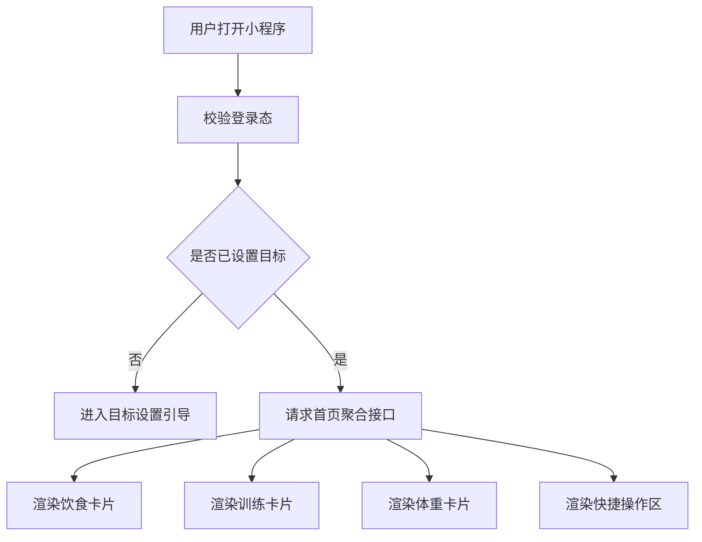

### 9.2 记录饮食流程入口

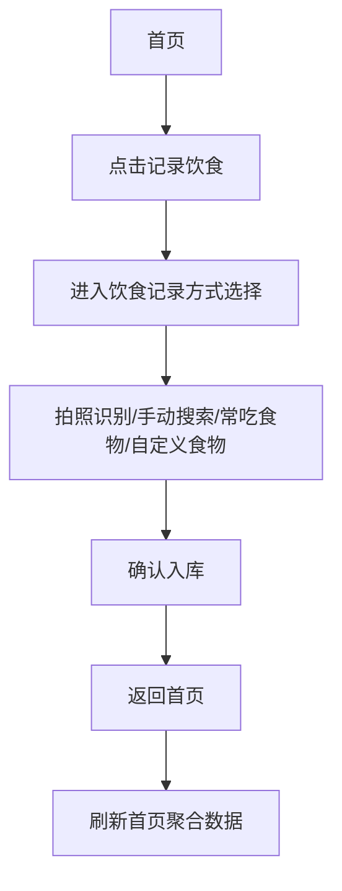

### 9.3 开始训练流程入口

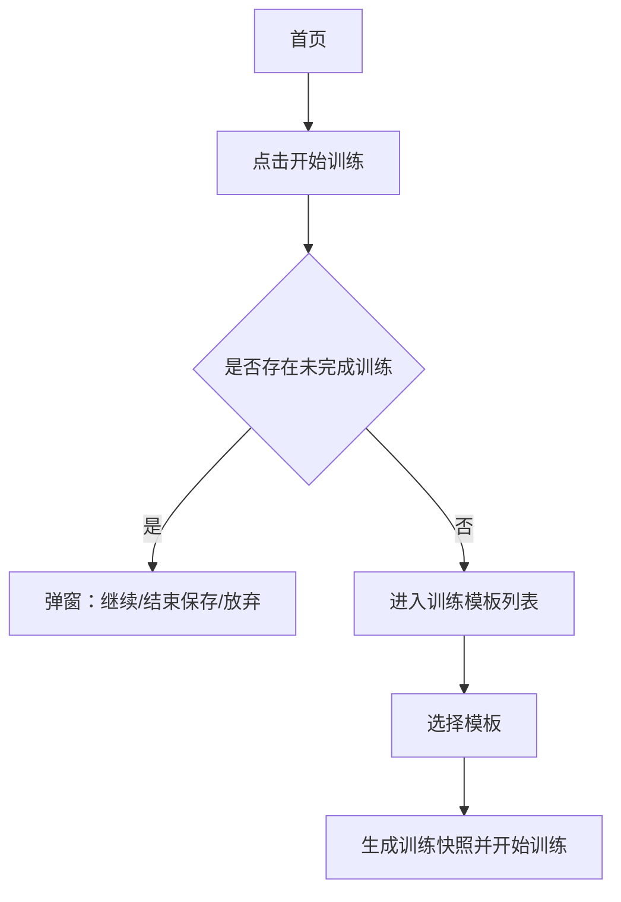

### 9.4 记录体重流程入口

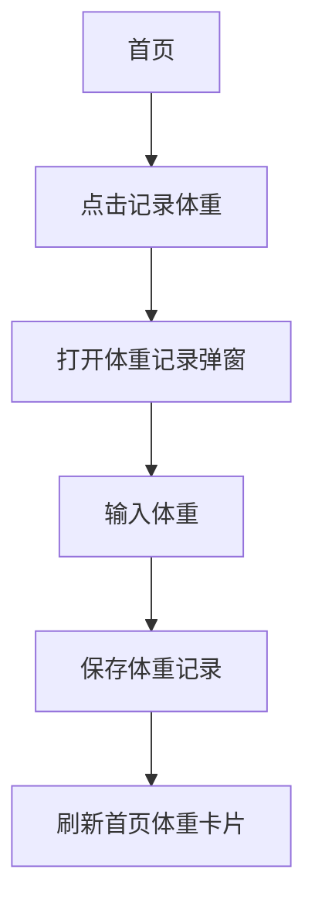

## 10. 字段定义

### 10.1 首页聚合数据

| 字段名 | 类型 | 必填 | 说明 |
|---|---|---|---|
| user_id | string | 是 | 当前用户 ID |
| stat_date | date | 是 | 统计日期 |
| calorie_target | number | 是 | 每日热量目标 |
| protein_target | number | 是 | 每日蛋白质目标 |
| calorie_intake | number | 是 | 今日摄入热量 |
| protein_intake | number | 是 | 今日摄入蛋白质 |
| carb_intake | number | 否 | 今日碳水 |
| fat_intake | number | 否 | 今日脂肪 |
| training_status | enum | 是 | 今日训练状态 |
| weekly_training_count | number | 是 | 本周训练次数 |
| latest_weight | number | 否 | 最新体重 |
| target_weight | number | 否 | 目标体重 |
| target_diff | number | 否 | 目标差距 |

## 11. 空状态

### 11.1 未设置目标

文案：

> 先设置你的每日目标，开始管理饮食和训练。

按钮：

- 去设置目标。

### 11.2 今日无饮食记录

文案：

> 今天还没有记录饮食。

按钮：

- 记录第一餐。

### 11.3 今日无训练记录

文案：

> 今天还没有训练记录。

按钮：

- 开始训练。

### 11.4 无体重记录

文案：

> 记录体重后，可以查看减脂趋势。

按钮：

- 记录体重。

## 12. 验收标准

1. 用户登录后可以进入首页。
2. 首页可以展示今日热量和目标热量。
3. 首页可以展示今日蛋白质和蛋白质目标。
4. 首页可以展示今日训练状态。
5. 首页可以展示本周训练次数。
6. 首页可以展示最新体重和目标体重差距。
7. 首页提供记录饮食、开始训练、记录体重入口。
8. 新增饮食后首页热量和蛋白质更新。
9. 完成训练后首页训练状态更新。
10. 新增体重后首页体重数据更新。
11. 存在未完成训练时首页展示继续训练入口。
12. 首页接口请求失败时展示重试入口，不白屏。

## 13. 技术实现建议

### 13.1 前端

前端为微信小程序首页页面，建议在 `onShow` 中请求首页聚合接口，以保证从其他页面返回时数据刷新。

### 13.2 后端

建议提供统一聚合接口：

```http
GET /api/home/dashboard?date=YYYY-MM-DD
```

后端统一聚合：

- 用户目标；
- 今日饮食汇总；
- 今日训练状态；
- 本周训练次数；
- 最新体重；
- 未完成训练状态。

### 13.3 数据一致性

首页不应由前端分别请求饮食、训练、体重后自行拼装统计。首页展示以服务端聚合结果为准。


---

# 饮食记录模块 PRD

## 1. 模块定位

饮食记录模块用于帮助用户记录每日饮食摄入，并自动汇总热量、蛋白质、碳水、脂肪等营养数据。

MVP 阶段核心定位：

> 通过 AI 拍照识别降低录入成本，通过用户确认和修正确保数据可靠。

AI 识别不直接入库，所有结果必须由用户确认后才计入统计。

## 2. MVP 功能范围

第一版实现：

1. 拍照识别饮食；
2. 手动搜索食物；
3. 常吃食物快速记录；
4. 自定义食物；
5. 用户确认后入库；
6. 修改食物名称、份量、克数、营养数据；
7. 删除单个识别结果；
8. 撤销最近一次记录；
9. 编辑 / 删除任意饮食记录；
10. 保存为常吃食物；
11. 早餐 / 午餐 / 晚餐 / 加餐分类；
12. 自动统计每日热量、蛋白质、碳水、脂肪。

## 3. 非本期范围

MVP 阶段不做：

- 自动精准称重；
- 自动拆分复杂菜品真实重量；
- 条形码识别；
- 外卖订单导入；
- AI 自动生成减脂餐单；
- 饮食图片长期保存；
- 微量营养素统计；
- 饮水记录；
- 膳食纤维统计；
- 智能设备同步。

## 4. 核心原则

### 4.1 AI 只做辅助

AI 识别结果必须进入待确认状态。用户点击“确认记录”后，才生成正式饮食记录。

### 4.2 用户确认数据为最终数据

统计以用户确认后的食物名称、克数、热量和营养素为准。

### 4.3 不保存饮食图片

MVP 不保存原图，也不保存压缩图。图片只用于本次识别流程，后端处理后应删除临时文件。

### 4.4 支持低成本纠错

用户至少可以修改：

- 食物名称；
- 份量；
- 克数；
- 热量；
- 蛋白质；
- 碳水；
- 脂肪；
- 餐次；
- 记录时间。

## 5. 页面入口

1. 首页点击“记录饮食”；
2. 饮食页点击“记录饮食”；
3. 常吃食物页点击某个常吃食物；
4. 记录成功页点击“继续记录”。

## 6. 餐次定义

| 餐次 | 枚举值 | 说明 |
|---|---|---|
| 早餐 | breakfast | 早餐记录 |
| 午餐 | lunch | 午餐记录 |
| 晚餐 | dinner | 晚餐记录 |
| 加餐 | snack | 零食、饮料、夜宵、训练前后加餐 |

默认餐次可按当前时间推荐，但用户必须可以手动修改。

建议默认规则：

| 时间段 | 默认餐次 |
|---|---|
| 05:00–10:30 | 早餐 |
| 10:31–14:30 | 午餐 |
| 14:31–20:30 | 晚餐 |
| 20:31–04:59 | 加餐 |

## 7. 拍照识别流程

### 7.1 操作步骤

1. 用户点击“记录饮食”。
2. 选择餐次。
3. 点击“拍照识别”。
4. 拍照或从相册选择图片。
5. 前端将图片临时上传到后端。
6. 后端调用第三方 AI 食物识别服务。
7. AI 返回识别结果。
8. 前端展示识别出的食物列表。
9. 用户删除误识别食物。
10. 用户修改名称、份量、克数、营养数据。
11. 用户点击“确认记录”。
12. 系统生成正式饮食记录。
13. 首页饮食统计更新。

### 7.2 流程图

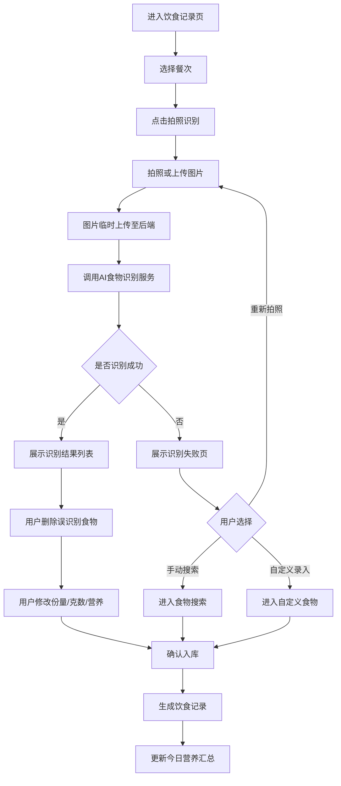

### 7.3 识别结果页展示字段

每个食物展示：

| 字段 | 说明 |
|---|---|
| 食物名称 | AI 识别或用户修改后的名称 |
| 份量 | 例如 1 碗、1 个、半份 |
| 克数 | 用于营养计算 |
| 热量 | 本次食物热量 |
| 蛋白质 | 本次食物蛋白质 |
| 碳水 | 本次食物碳水 |
| 脂肪 | 本次食物脂肪 |
| 编辑按钮 | 修改食物信息 |
| 删除按钮 | 删除误识别项 |

页面底部展示：

- 本次总热量；
- 本次总蛋白质；
- 确认记录按钮；
- 保存为常吃食物选项。

## 8. 识别失败处理

识别失败时展示文案：

> 这张图片暂时无法准确识别。你可以重新拍照，或通过手动搜索 / 自定义录入完成记录。

提供入口：

1. 重新拍照；
2. 手动搜索；
3. 自定义录入。

## 9. 手动搜索食物流程

### 9.1 操作步骤

1. 用户选择“手动搜索”。
2. 选择餐次。
3. 输入食物关键词。
4. 系统搜索标准食物库和常吃食物。
5. 用户选择目标食物。
6. 系统带出每 100g 营养数据。
7. 用户输入份量或克数。
8. 系统换算本次营养值。
9. 用户确认入库。
10. 首页统计更新。

### 9.2 搜索结果字段

| 字段 | 说明 |
|---|---|
| 食物名称 | 如鸡蛋、米饭、鸡胸肉 |
| 分类 | 主食、肉类、蔬菜、水果等 |
| 每100g热量 | kcal |
| 每100g蛋白质 | g |
| 每100g碳水 | g |
| 每100g脂肪 | g |
| 来源 | 标准库 / 常吃食物 |

## 10. 常吃食物流程

### 10.1 来源

常吃食物来源包括：

1. 用户手动创建；
2. AI 识别后用户勾选“保存为常吃”；
3. 自定义食物保存为常吃。

### 10.2 操作步骤

1. 用户进入常吃食物列表。
2. 选择某个常吃食物。
3. 系统带出默认份量、克数和营养数据。
4. 用户按本次情况修改。
5. 用户确认入库。
6. 系统生成饮食记录。

### 10.3 规则

1. 常吃食物只对当前用户可见。
2. 第一版不做高频自动推荐。
3. 删除常吃食物不影响历史饮食记录。

## 11. 自定义食物流程

### 11.1 操作步骤

1. 用户进入自定义食物页面。
2. 输入食物名称。
3. 输入克数。
4. 输入热量。
5. 输入蛋白质、碳水、脂肪。
6. 选择餐次。
7. 选择是否保存为常吃食物。
8. 确认入库。

### 11.2 必填字段

| 字段 | 规则 |
|---|---|
| 食物名称 | 必填，最多 30 字 |
| 克数 | 必填，必须大于 0 |
| 热量 | 必填，必须大于等于 0 |
| 蛋白质 | 选填，必须大于等于 0 |
| 碳水 | 选填，必须大于等于 0 |
| 脂肪 | 选填，必须大于等于 0 |

## 12. 饮食记录编辑、删除、撤销

### 12.1 编辑

可编辑字段：

- 餐次；
- 记录时间；
- 食物名称；
- 份量；
- 克数；
- 热量；
- 蛋白质；
- 碳水；
- 脂肪。

编辑后重新计算该日期饮食汇总。

### 12.2 删除

删除采用软删除。删除后：

1. 不再展示；
2. 不计入统计；
3. 重新计算对应日期营养汇总。

### 12.3 撤销

最近一次新增饮食记录支持快捷撤销。撤销后该记录状态为 revoked，不计入统计。

## 13. 营养计算规则

如果食物库提供每 100g 营养数据：

```text
本次营养值 = 每100g营养值 × 本次克数 / 100
```

需要计算：

- 热量；
- 蛋白质；
- 碳水；
- 脂肪。

最终统计以用户确认后的克数和营养数据为准。

## 14. 数据字段

### 14.1 meal_record

| 字段名 | 类型 | 说明 |
|---|---|---|
| id | string | 饮食记录 ID |
| user_id | string | 用户 ID |
| record_date | date | 记录日期 |
| record_time | datetime | 具体时间 |
| meal_type | enum | breakfast/lunch/dinner/snack |
| source_type | enum | photo_ai/manual_search/frequent_food/custom |
| total_calorie | number | 本次总热量 |
| total_protein | number | 本次总蛋白质 |
| total_carb | number | 本次总碳水 |
| total_fat | number | 本次总脂肪 |
| status | enum | draft/confirmed/revoked/deleted |
| is_saved_as_frequent | boolean | 是否保存为常吃 |
| created_at | datetime | 创建时间 |
| updated_at | datetime | 更新时间 |

### 14.2 meal_food_item

| 字段名 | 类型 | 说明 |
|---|---|---|
| id | string | 明细 ID |
| meal_record_id | string | 所属饮食记录 |
| user_id | string | 用户 ID |
| food_name | string | 食物名称 |
| food_category | string | 食物分类 |
| portion_desc | string | 份量描述 |
| weight_g | number | 克数 |
| calorie | number | 热量 |
| protein | number | 蛋白质 |
| carb | number | 碳水 |
| fat | number | 脂肪 |
| data_source | enum | ai/standard_db/user_custom/frequent |
| is_user_modified | boolean | 是否用户修改 |
| is_deleted | boolean | 是否删除 |
| created_at | datetime | 创建时间 |
| updated_at | datetime | 更新时间 |

### 14.3 frequent_food

| 字段名 | 类型 | 说明 |
|---|---|---|
| id | string | 常吃食物 ID |
| user_id | string | 用户 ID |
| food_name | string | 食物名称 |
| default_portion_desc | string | 默认份量 |
| default_weight_g | number | 默认克数 |
| calorie | number | 默认热量 |
| protein | number | 默认蛋白质 |
| carb | number | 默认碳水 |
| fat | number | 默认脂肪 |
| source_type | enum | ai_saved/custom/manual |
| use_count | number | 使用次数 |
| last_used_at | datetime | 最近使用时间 |
| status | enum | active/deleted |
| created_at | datetime | 创建时间 |
| updated_at | datetime | 更新时间 |

## 15. 接口建议

| 接口 | 方法 | 说明 |
|---|---|---|
| `/api/diet/recognize` | POST | 上传图片并识别食物 |
| `/api/diet/foods/search` | GET | 搜索标准食物和常吃食物 |
| `/api/diet/records/confirm` | POST | 确认饮食记录 |
| `/api/diet/records` | GET | 查询某日饮食记录 |
| `/api/diet/records/{record_id}` | PUT | 编辑饮食记录 |
| `/api/diet/records/{record_id}` | DELETE | 删除饮食记录 |
| `/api/diet/records/{record_id}/revoke` | POST | 撤销最近一次记录 |
| `/api/diet/frequent-foods` | GET | 查询常吃食物 |
| `/api/diet/frequent-foods` | POST | 新增常吃食物 |
| `/api/diet/frequent-foods/{food_id}` | DELETE | 删除常吃食物 |

## 16. 验收标准

1. 用户可以从首页进入饮食记录。
2. 用户可以拍照或上传图片。
3. AI 识别成功时展示食物列表。
4. AI 识别失败时展示兜底入口。
5. 用户可以删除单个识别食物。
6. 用户可以修改食物名称、份量、克数和营养数据。
7. 用户确认后生成正式饮食记录。
8. 未确认识别结果不计入首页统计。
9. 用户可以手动搜索食物。
10. 用户可以创建自定义食物。
11. 用户可以使用常吃食物。
12. 用户可以编辑、删除、撤销饮食记录。
13. 编辑、删除、撤销后首页统计同步更新。
14. 不保存饮食图片。

## 17. 技术风险

### 17.1 AI 识别准确率风险

中餐混合菜、酱料、烹饪方式、份量估算都可能导致误差。解决方式：

- AI 结果必须用户确认；
- 支持删除误识别项；
- 支持手动修改数据；
- 提供手动搜索和自定义兜底。

### 17.2 第三方 API 依赖风险

第三方服务可能失败、超时或收费变化。解决方式：

- 后端封装 FoodRecognitionAdapter；
- 前端不直接调用第三方；
- 失败后进入手动兜底；
- MVP 可先使用 mock 识别结果。


---

# 训练模板与训练执行模块 PRD

## 1. 模块定位

训练模块负责帮助用户创建训练计划、按计划执行训练、自动管理组间休息，并沉淀训练历史。

MVP 阶段核心体验：

> 创建训练模板 → 开始训练 → 完成本组 → 自动休息倒计时 → 进入下一组 → 完成训练 → 保存历史。

## 2. MVP 功能范围

第一版实现：

1. 创建训练模板；
2. 编辑、删除、复制训练模板；
3. 普通动作训练；
4. 每组不同重量、次数、休息时间；
5. 简化版超级组；
6. 简化版递减组；
7. 开始训练时生成模板快照；
8. 训练中修改实际重量和次数；
9. 训练中临时加组；
10. 训练中跳过动作、组或重量段；
11. 完成本组后自动进入休息倒计时；
12. 休息中跳过休息；
13. 休息中延长休息；
14. 倒计时结束提醒；
15. 训练中断恢复；
16. 完成训练并保存历史；
17. 查看训练历史。

## 3. 非本期范围

MVP 不实现：

- AI 自动生成训练计划；
- AI 推荐训练重量；
- 动作视频识别；
- 智能手表同步；
- 私教协同；
- 社区打卡；
- 高级周期化训练；
- 超级组嵌套；
- 递减组与超级组复杂混合；
- 1RM 自动计算；
- 训练容量趋势图。

## 4. 核心原则

### 4.1 模板与训练记录分离

训练模板用于未来训练安排。训练记录保存某一次真实训练结果。开始训练时必须复制模板生成训练快照。

### 4.2 历史记录不受模板修改影响

用户修改模板后，不影响已经完成的历史训练记录。

### 4.3 训练中操作要轻

训练中页面重点提供：

- 修改实际重量；
- 修改实际次数；
- 完成本组；
- 跳过；
- 跳过休息；
- 延长休息；
- 结束训练。

### 4.4 休息倒计时基于时间戳

训练休息不能只依赖前端定时器。系统应保存：

- 休息开始时间；
- 目标结束时间；
- 实际结束时间。

用户切后台或重新进入后，根据当前时间校准。

### 4.5 后台提醒不强承诺

微信小程序无法强承诺长时间后台精准响铃。MVP 承诺：

- 前台沉浸式倒计时；
- 回到小程序后自动校准休息状态；
- 后台震动/声音仅作为增强能力。

## 5. 核心概念

### 5.1 训练模板

用户预先配置的训练计划，例如：

- 胸肩三头；
- 背二头；
- 腿臀日；
- 有氧日。

### 5.2 训练单元

训练模板由多个训练单元组成。MVP 支持：

| 类型 | 说明 |
|---|---|
| 普通动作 | 单个动作，由多组组成 |
| 超级组 | 多个动作按顺序完成，全部完成后统一休息 |
| 递减组 | 同一动作多个重量段连续完成，中间不休息 |

### 5.3 训练快照

用户开始训练时，由模板复制生成的本次训练数据。后续模板修改不影响快照。

## 6. 训练模板列表页

展示：

1. 模板名称；
2. 最近使用时间；
3. 动作数量；
4. 开始训练按钮；
5. 编辑按钮；
6. 复制按钮；
7. 删除按钮。

提供：

- 创建训练模板；
- 复制上一次训练。

## 7. 创建训练模板流程

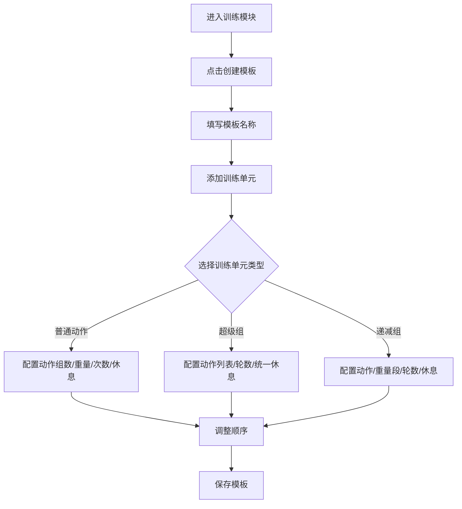

## 8. 普通动作配置

普通动作示例：

| 组 | 目标重量 | 目标次数 | 休息 |
|---|---:|---:|---:|
| 1 | 60kg | 12 | 180秒 |
| 2 | 70kg | 10 | 180秒 |
| 3 | 75kg | 8 | 180秒 |
| 4 | 80kg | 6 | 180秒 |

字段：

- 动作名称；
- 动作备注；
- 组序号；
- 每组目标重量；
- 每组目标次数；
- 每组休息时间。

## 9. 简化版超级组配置

规则：

> 多个动作按顺序完成，全部动作完成后统一休息。

示例：

超级组 A，重复 4 轮：

1. 哑铃卧推 12 次；
2. 俯卧撑 15 次；
3. 绳索夹胸 12 次；
4. 完成一轮后休息 120 秒。

字段：

- 超级组名称；
- 轮数；
- 动作列表；
- 每个动作目标重量；
- 每个动作目标次数；
- 每轮统一休息时间。

MVP 不支持：

- 超级组嵌套；
- 超级组内每个动作复杂休息；
- 超级组与递减组嵌套。

## 10. 简化版递减组配置

规则：

> 同一动作在一轮内连续完成多个重量段，中间不休息，全部完成后统一休息。

示例：

侧平举递减组，3 轮：

| 重量段 | 目标重量 | 目标次数 |
|---|---:|---:|
| 1 | 10kg | 10 |
| 2 | 7.5kg | 8 |
| 3 | 5kg | 8 |

每轮完成后休息 120 秒。

字段：

- 动作名称；
- 轮数；
- 重量段列表；
- 每段目标重量；
- 每段目标次数；
- 每轮完成后休息时间。

## 11. 开始训练流程

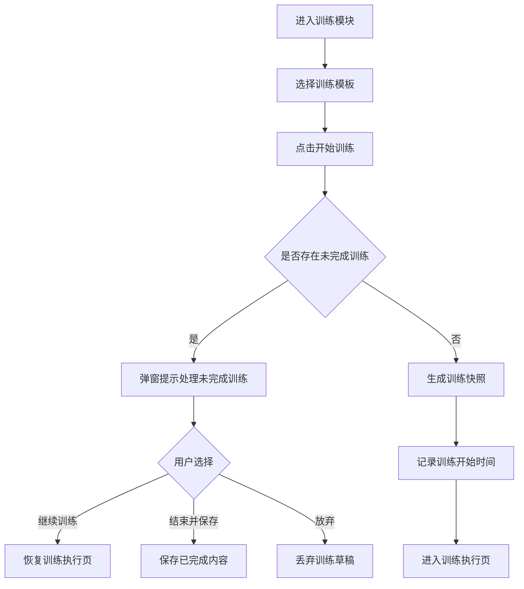

## 12. 训练执行页

### 12.1 展示内容

| 内容 | 说明 |
|---|---|
| 当前训练模板名称 | 如胸肩三头 |
| 当前训练单元名称 | 如卧推 / 胸部超级组 A |
| 当前动作名称 | 如卧推 |
| 当前组数 / 轮次 | 如第 2 / 4 组 |
| 目标重量 | 当前项目标重量 |
| 目标次数 | 当前项目标次数 |
| 实际重量 | 默认等于目标重量，可修改 |
| 实际次数 | 默认等于目标次数，可修改 |
| 下一项预告 | 下一组或下一动作 |
| 完成本组按钮 | 主按钮 |
| 跳过按钮 | 次按钮 |
| 临时加组按钮 | 仅普通动作支持 |
| 结束训练按钮 | 辅助入口 |

### 12.2 普通动作执行

1. 展示当前动作和当前组。
2. 用户修改实际重量或次数。
3. 点击“完成本组”。
4. 保存实际数据。
5. 如果配置休息，进入休息倒计时。
6. 否则进入下一组或下一动作。

### 12.3 超级组执行

1. 进入当前轮第一个动作。
2. 完成后进入同轮下一个动作。
3. 当前轮全部动作完成后统一休息。
4. 休息结束进入下一轮。
5. 所有轮完成后进入下一个训练单元。

超级组中允许跳过某个动作，并记录为 skipped。

### 12.4 递减组执行

1. 进入当前轮第一个重量段。
2. 完成后立即进入下一个重量段。
3. 当前轮所有重量段完成后休息。
4. 休息结束进入下一轮。
5. 所有轮完成后进入下一个训练单元。

递减组中允许跳过某个重量段，并记录为 skipped。

## 13. 休息倒计时

### 13.1 展示内容

- 剩余休息时间；
- 已完成内容；
- 下一项内容；
- 跳过休息；
- 延长休息；
- 结束训练。

### 13.2 操作

#### 跳过休息

记录实际休息时间，进入下一训练项。

#### 延长休息

固定选项：

- +30 秒；
- +60 秒；
- +120 秒。

#### 倒计时结束

触发提醒，展示“休息结束”，用户点击“开始下一组”。

## 14. 训练中断恢复

触发场景：

- 用户切到微信聊天；
- 用户锁屏；
- 用户返回桌面；
- 小程序被关闭。

恢复时：

1. 系统检查未完成训练。
2. 弹窗提示：
   - 继续训练；
   - 结束并保存；
   - 放弃本次训练。
3. 若上次状态是休息中，根据目标结束时间校准倒计时。
4. 若休息已结束，提示进入下一组。

## 15. 临时加组

规则：

1. MVP 仅普通动作支持临时加组。
2. 新组默认复制上一组重量、次数、休息时间。
3. 临时加组只进入本次训练记录。
4. 不自动修改模板。
5. 历史记录中标记 `is_temporary_added = true`。

## 16. 结束训练

点击结束训练后弹窗：

1. 结束并保存；
2. 放弃本次训练；
3. 继续训练。

规则：

- 正常完成：状态 completed，进入历史；
- 中断保存：状态 interrupted_saved，进入历史；
- 放弃：状态 abandoned，不进入历史，不计入训练次数。

## 17. 训练历史

列表展示：

- 训练日期；
- 模板名称；
- 训练状态；
- 训练时长；
- 完成组数；
- 跳过组数。

详情展示：

- 每个训练单元；
- 每个动作；
- 目标重量 / 实际重量；
- 目标次数 / 实际次数；
- 实际休息时间；
- 跳过项；
- 临时加组。

## 18. 数据字段

### 18.1 training_template

| 字段 | 说明 |
|---|---|
| id | 模板 ID |
| user_id | 用户 ID |
| template_name | 模板名称 |
| description | 描述 |
| goal_type | fat_loss/muscle_gain/strength/other |
| status | active/deleted |
| created_at | 创建时间 |
| updated_at | 更新时间 |

### 18.2 training_template_unit

| 字段 | 说明 |
|---|---|
| id | 模板单元 ID |
| template_id | 模板 ID |
| user_id | 用户 ID |
| unit_type | normal/superset/dropset |
| unit_name | 单元名称 |
| sort_order | 排序 |
| config_json | 单元配置 |
| created_at | 创建时间 |
| updated_at | 更新时间 |

### 18.3 training_session

| 字段 | 说明 |
|---|---|
| id | 训练会话 ID |
| user_id | 用户 ID |
| template_id | 来源模板 |
| template_name_snapshot | 模板名称快照 |
| session_status | draft/in_progress/resting/completed/interrupted_saved/abandoned |
| start_time | 开始时间 |
| end_time | 结束时间 |
| duration_seconds | 总时长 |
| current_unit_id | 当前单元 |
| current_item_id | 当前项 |
| is_snapshot | 是否快照 |
| created_at | 创建时间 |
| updated_at | 更新时间 |

### 18.4 training_session_item

| 字段 | 说明 |
|---|---|
| id | 执行项 ID |
| session_id | 会话 ID |
| session_unit_id | 会话单元 ID |
| user_id | 用户 ID |
| exercise_name | 动作名称 |
| round_index | 超级组或递减组轮次 |
| set_index | 普通动作组序号 |
| segment_index | 递减组重量段序号 |
| target_weight | 目标重量 |
| target_reps | 目标次数 |
| actual_weight | 实际重量 |
| actual_reps | 实际次数 |
| target_rest_seconds | 目标休息 |
| actual_rest_seconds | 实际休息 |
| status | not_started/in_progress/completed/skipped/unfinished |
| is_temporary_added | 是否临时加组 |
| completed_at | 完成时间 |

## 19. 接口建议

| 接口 | 方法 | 说明 |
|---|---|---|
| `/api/training/templates` | POST | 创建模板 |
| `/api/training/templates` | GET | 模板列表 |
| `/api/training/templates/{template_id}` | GET | 模板详情 |
| `/api/training/templates/{template_id}` | PUT | 更新模板 |
| `/api/training/templates/{template_id}` | DELETE | 删除模板 |
| `/api/training/sessions/start` | POST | 开始训练 |
| `/api/training/sessions/unfinished` | GET | 查询未完成训练 |
| `/api/training/sessions/{session_id}` | GET | 训练会话详情 |
| `/api/training/sessions/{session_id}/items/{item_id}/complete` | POST | 完成当前项 |
| `/api/training/sessions/{session_id}/items/{item_id}/skip` | POST | 跳过当前项 |
| `/api/training/sessions/{session_id}/rest/{rest_id}/skip` | POST | 跳过休息 |
| `/api/training/sessions/{session_id}/rest/{rest_id}/extend` | POST | 延长休息 |
| `/api/training/sessions/{session_id}/items/add-temp-set` | POST | 临时加组 |
| `/api/training/sessions/{session_id}/finish` | POST | 结束训练 |
| `/api/training/sessions/history` | GET | 训练历史 |
| `/api/training/sessions/{session_id}/history-detail` | GET | 历史详情 |

## 20. 验收标准

1. 用户可以创建普通动作模板。
2. 普通动作支持每组不同重量、次数、休息时间。
3. 用户可以创建简化版超级组。
4. 用户可以创建简化版递减组。
5. 用户可以编辑、复制、删除模板。
6. 开始训练时生成训练快照。
7. 模板修改不影响历史训练记录。
8. 训练执行页展示当前动作、组、目标重量、目标次数。
9. 用户可以修改实际重量和次数。
10. 完成当前项后自动进入休息倒计时。
11. 用户可以跳过休息和延长休息。
12. 用户可以跳过训练项并记录 skipped。
13. 用户可以临时加组。
14. 用户退出后重新进入可以恢复训练。
15. 完成训练后生成训练历史。
16. 放弃训练不进入历史。

## 21. 技术风险

### 21.1 后台计时风险

微信小程序后台计时不可靠，不能承诺长时间后台精准响铃。处理方式：

- 服务端保存休息开始时间和目标结束时间；
- 前台倒计时只做 UI；
- 回到小程序后按时间戳校准。

### 21.2 训练结构复杂风险

普通组、超级组、递减组结构不同。处理方式：

- 使用 unit_type 统一建模；
- 执行层统一拆解为 session_item；
- 历史保存快照。


---

# 体重记录模块 PRD

## 1. 模块定位

体重记录模块用于记录用户在减脂或增肌周期中的体重变化，并将体重数据与首页看板、目标体重和趋势分析打通。

MVP 阶段核心定位：

> 低成本记录体重，展示近期趋势，帮助用户判断减脂或增肌执行效果。

## 2. MVP 功能范围

第一版实现：

1. 记录体重；
2. 自动记录当前时间；
3. 支持手动修改记录时间；
4. 同一天允许多条体重记录；
5. 首页展示当天最新体重；
6. 当天无记录时首页展示最近一次历史体重；
7. 历史体重列表；
8. 编辑体重记录；
9. 删除体重记录；
10. 最近 7 天趋势；
11. 最近 30 天趋势；
12. 目标体重差距展示。

## 3. 非本期范围

MVP 不实现：

- 体脂率记录；
- 肌肉量记录；
- 骨骼肌记录；
- 水分率记录；
- BMI 自动分析；
- 基础代谢计算；
- 智能体脂秤同步；
- 围度记录；
- 体型照片；
- 周报 / 月报；
- AI 体重变化建议。

## 4. 核心原则

### 4.1 同一天允许多次记录

用户可能早晚称重，也可能录错后重新记录。因此允许同一天多条记录。

### 4.2 首页展示当天最新体重

如果当天有多条体重，首页展示当天最新一条。当天没有记录时，展示最近一次历史记录。

### 4.3 趋势图使用每日最新体重

为了避免趋势混乱，7 天和 30 天趋势默认按每日最新体重作为当天统计点。

### 4.4 所有记录支持编辑和删除

用户录错体重或时间后，可以修改或删除。删除后首页和趋势图重新计算。

## 5. 页面入口

1. 首页体重卡片点击“记录体重”；
2. 首页体重卡片点击“查看趋势”；
3. 体重模块点击“新增体重记录”。

## 6. 页面结构

体重页面包含：

1. 当前体重卡片；
2. 目标体重和目标差距卡片；
3. 7 天 / 30 天趋势切换；
4. 历史记录列表；
5. 新增体重按钮。

## 7. 新增体重流程

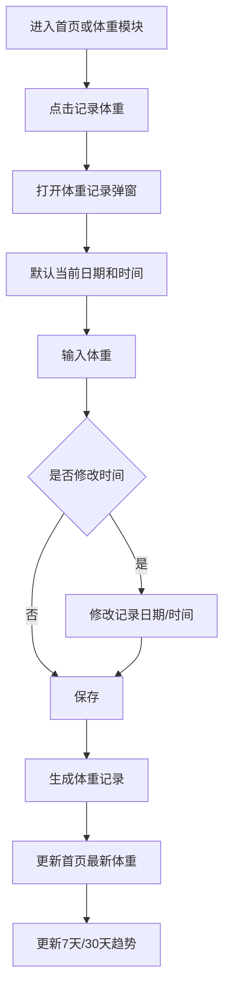

## 8. 记录体重弹窗

字段：

| 字段 | 说明 |
|---|---|
| 体重 | 必填，单位 kg |
| 日期 | 默认当前日期，可修改 |
| 时间 | 默认当前时间，可修改 |
| 备注 | 选填 |

交互建议：

1. 体重输入框自动聚焦；
2. 默认显示上一次体重作为参考；
3. 输入支持 1 位小数；
4. 保存成功后 toast 提示“体重已记录”。

## 9. 编辑体重记录

用户可以编辑：

- 体重；
- 记录日期；
- 记录时间；
- 备注。

编辑后系统重新计算首页最新体重和趋势点。

## 10. 删除体重记录

删除前二次确认。删除采用软删除：

1. 状态变为 deleted；
2. 不展示在历史列表；
3. 不计入趋势；
4. 不计入首页最新体重。

## 11. 首页展示规则

首页体重卡片优先级：

1. 当天最新体重；
2. 最近一次历史体重；
3. 用户资料中的当前体重；
4. 空状态。

## 12. 目标差距计算

```text
距离目标 = 当前展示体重 - 目标体重
```

减脂阶段：

- 正数：还需减少；
- 0 或负数：已达到或低于目标。

增肌阶段：

- 负数：还需增加；
- 0 或正数：已达到或超过目标。

## 13. 趋势统计规则

### 13.1 7 天趋势

展示最近 7 天内每日最新体重。无记录日期不补点。

### 13.2 30 天趋势

展示最近 30 天内每日最新体重。无记录日期不补点。

### 13.3 同一天多条记录

趋势图取当天最新一条。

示例：

| 时间 | 体重 |
|---|---:|
| 2026-07-05 08:00 | 75.8kg |
| 2026-07-05 21:30 | 76.2kg |

趋势图中 2026-07-05 取 76.2kg。

## 14. 历史列表展示规则

历史列表按记录时间倒序展示，不合并同一天多条记录。

展示：

- 体重；
- 记录日期；
- 记录时间；
- 备注；
- 编辑入口；
- 删除入口。

## 15. 数据字段

### weight_record

| 字段名 | 类型 | 说明 |
|---|---|---|
| id | string | 体重记录 ID |
| user_id | string | 用户 ID |
| weight_kg | number | 体重 |
| record_time | datetime | 记录时间 |
| record_date | date | 记录日期 |
| note | string | 备注 |
| status | enum | normal/deleted |
| created_at | datetime | 创建时间 |
| updated_at | datetime | 更新时间 |

## 16. 接口建议

| 接口 | 方法 | 说明 |
|---|---|---|
| `/api/weight/records` | POST | 新增体重 |
| `/api/weight/records` | GET | 查询体重记录 |
| `/api/weight/records/{record_id}` | PUT | 编辑体重 |
| `/api/weight/records/{record_id}` | DELETE | 删除体重 |
| `/api/weight/trend?range=7d` | GET | 查询 7 天趋势 |
| `/api/weight/trend?range=30d` | GET | 查询 30 天趋势 |

## 17. 校验规则

| 字段 | 规则 |
|---|---|
| 体重 | 必填，20–300kg |
| 小数位 | 最多 1 位 |
| 时间 | 不允许未来时间 |
| 单位 | MVP 固定 kg |

## 18. 空状态

### 18.1 无体重记录

文案：

> 记录你的第一次体重，开始观察变化趋势。

按钮：

- 记录体重。

### 18.2 趋势数据不足

如果记录少于 2 条：

> 继续记录几天后，就可以看到体重变化趋势。

### 18.3 当前范围无数据

> 最近 7 天还没有体重记录。

按钮：

- 记录体重；
- 查看全部记录。

## 19. 验收标准

1. 用户可以从首页进入体重记录入口。
2. 用户可以新增体重。
3. 系统默认记录当前日期和时间。
4. 用户可以修改记录时间。
5. 同一天可以新增多条体重记录。
6. 首页展示当天最新体重。
7. 当天无体重时首页展示最近一次历史体重。
8. 用户可以查看 7 天趋势。
9. 用户可以查看 30 天趋势。
10. 趋势图每天取最新一条体重。
11. 用户可以编辑体重记录。
12. 用户可以删除体重记录。
13. 删除后首页和趋势重新计算。
14. 不允许保存未来时间。

## 20. 技术风险

### 20.1 同日多条导致展示混乱

处理方式：

- 首页取当天最新；
- 趋势取每日最新；
- 历史列表展示所有记录；
- 统计规则统一放在后端。

### 20.2 体重短期波动误读

MVP 只展示趋势，不做强结论。后续可增加周均体重。


---

# 目标设置与用户基础信息模块 PRD

## 1. 模块定位

目标设置与用户基础信息模块用于记录用户身体基础信息、当前阶段目标和每日营养目标，是首页看板、饮食统计和体重目标展示的数据基础。

MVP 阶段核心定位：

> 让用户手动设置减脂 / 增肌阶段核心目标，并为首页、饮食、体重模块提供统一目标数据。

## 2. MVP 功能范围

第一版实现：

1. 微信授权登录；
2. 获取用户唯一标识；
3. 设置当前阶段：减脂 / 增肌；
4. 设置每日热量目标；
5. 设置每日蛋白质目标；
6. 设置当前体重；
7. 设置目标体重；
8. 设置基础身体信息；
9. 编辑目标设置；
10. 首页读取目标数据；
11. 饮食模块读取热量和蛋白质目标；
12. 体重模块读取目标体重；
13. 所有用户数据按 user_id 隔离。

## 3. 非本期范围

MVP 不实现：

- 自动计算 TDEE；
- 自动计算基础代谢；
- 自动推荐热量目标；
- 自动推荐碳水和脂肪目标；
- 饮水目标；
- 微量营养素目标；
- AI 饮食计划；
- AI 训练计划；
- 多目标周期管理；
- 私教查看用户目标。

## 4. 核心原则

### 4.1 第一版以手动设置为主

用户手动填写每日热量目标、蛋白质目标和目标体重。MVP 不依赖复杂算法推荐。

### 4.2 目标数据统一管理

首页、饮食、体重模块都从同一份目标配置中读取数据。

### 4.3 按 user_id 隔离数据

所有目标、资料、饮食、训练、体重记录都必须绑定 user_id。

### 4.4 允许修改目标

用户可以从减脂切换到增肌，也可以调整每日目标。修改目标后：

- 影响未来展示；
- 不修改历史饮食、训练、体重记录。

## 5. 用户使用场景

### 5.1 首次进入小程序

用户首次登录后完成基础目标设置：

- 当前阶段；
- 当前体重；
- 目标体重；
- 每日热量目标；
- 每日蛋白质目标。

完成后进入首页。

### 5.2 修改减脂目标

用户将每日热量目标从 1800 kcal 修改为 2000 kcal。首页和饮食页立即按新目标展示。

### 5.3 从减脂切换到增肌

用户达到目标体重后，将当前阶段切换为增肌，并重新设置目标体重和每日目标。

## 6. 页面入口

1. 首次登录目标设置引导页；
2. 首页目标卡片入口；
3. 我的页面中的目标设置；
4. 我的页面中的个人基础信息。

## 7. 首次目标设置页

建议分 3 步：

### 第一步：选择当前阶段

- 减脂；
- 增肌。

### 第二步：填写身体信息

- 当前体重；
- 目标体重；
- 身高；
- 性别；
- 出生年份。

### 第三步：填写每日目标

- 每日热量目标；
- 每日蛋白质目标。

MVP 建议热量目标和蛋白质目标必填，其他信息可选。

## 8. 目标设置编辑页

用户可以修改：

- 当前阶段；
- 当前体重；
- 目标体重；
- 每日热量目标；
- 每日蛋白质目标；
- 身高；
- 性别；
- 出生年份。

切换阶段时提示：

> 切换阶段后，首页和饮食目标将按新的目标展示，历史记录不会被修改。

## 9. 当前体重与体重记录关系

目标设置页中的当前体重用于基础资料。

首页最新体重优先从体重记录模块读取。如果没有体重记录，才使用 user_profile.current_weight_kg。

如果用户在目标设置页修改当前体重，建议提示：

> 是否将当前体重同步保存为一条体重记录？

MVP 可默认同步生成体重记录。

## 10. 数据字段

### 10.1 user_account

| 字段 | 说明 |
|---|---|
| id | 账户 ID |
| user_id | 系统用户 ID |
| openid | 微信 openid |
| unionid | 微信 unionid，后续扩展 |
| status | normal/disabled/deleted |
| last_login_at | 最近登录时间 |
| created_at | 创建时间 |
| updated_at | 更新时间 |

### 10.2 user_profile

| 字段 | 说明 |
|---|---|
| id | 用户资料 ID |
| user_id | 用户 ID |
| nickname | 昵称 |
| avatar_url | 头像 |
| gender | male/female/unknown |
| birth_year | 出生年份 |
| height_cm | 身高 |
| current_weight_kg | 当前体重 |
| created_at | 创建时间 |
| updated_at | 更新时间 |

### 10.3 user_goal

| 字段 | 说明 |
|---|---|
| id | 目标 ID |
| user_id | 用户 ID |
| goal_stage | fat_loss/muscle_gain |
| calorie_target | 每日热量目标 |
| protein_target | 每日蛋白质目标 |
| target_weight_kg | 目标体重 |
| goal_status | active/archived |
| created_at | 创建时间 |
| updated_at | 更新时间 |

## 11. 核心流程

### 11.1 首次登录与目标设置

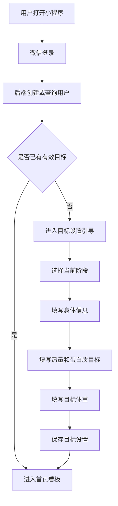

### 11.2 修改目标设置

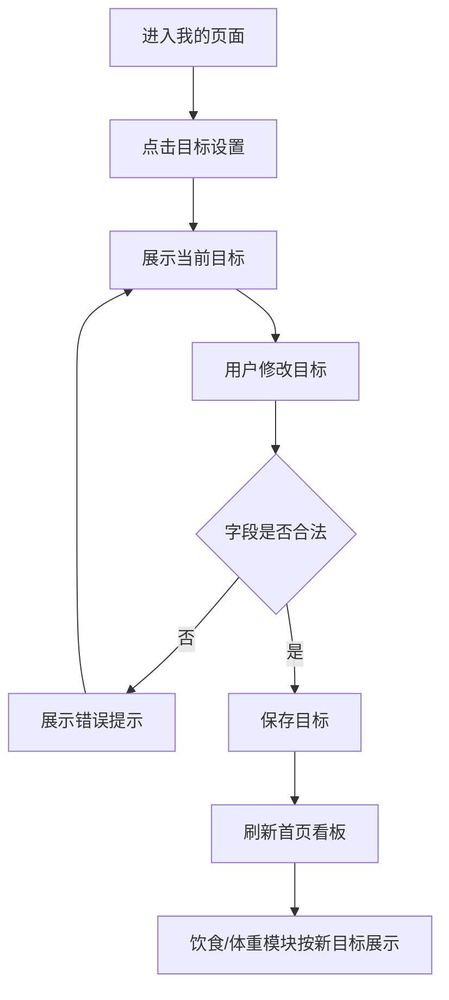

## 12. 字段校验

### 12.1 当前阶段

必须选择 fat_loss 或 muscle_gain。

### 12.2 每日热量目标

- 必填；
- 正整数；
- 建议范围：800–6000 kcal。

### 12.3 每日蛋白质目标

- 必填；
- 正整数；
- 建议范围：20–400 g。

### 12.4 当前体重和目标体重

- 选填但建议填写；
- 范围：20–300 kg；
- 最多 1 位小数。

### 12.5 身高

- 选填；
- 范围：100–250 cm。

### 12.6 出生年份

- 选填；
- 不允许大于当前年份。

## 13. 模块联动规则

### 13.1 首页

读取：

- 当前阶段；
- 每日热量目标；
- 每日蛋白质目标；
- 目标体重。

### 13.2 饮食模块

读取：

- 每日热量目标；
- 每日蛋白质目标。

用于计算：

- 热量完成率；
- 蛋白质完成率；
- 剩余热量；
- 蛋白质还差多少。

### 13.3 体重模块

读取：

- 当前阶段；
- 目标体重。

用于计算距离目标体重。

### 13.4 训练模块

MVP 阶段只读取当前阶段作为展示或模板筛选预留字段。

## 14. 目标修改影响范围

### 14.1 立即生效

目标修改后以下页面按新目标展示：

- 首页；
- 饮食详情；
- 体重详情；
- 我的目标设置页。

### 14.2 不影响历史数据

目标修改不修改：

- 已保存饮食记录；
- 已保存训练记录；
- 已保存体重记录。

MVP 不做目标历史快照。

## 15. 接口建议

| 接口 | 方法 | 说明 |
|---|---|---|
| `/api/auth/wechat-login` | POST | 微信登录 |
| `/api/user/profile` | GET | 查询基础信息 |
| `/api/user/profile` | PUT | 更新基础信息 |
| `/api/user/goal` | GET | 查询当前目标 |
| `/api/user/goal` | PUT | 创建或更新目标 |

## 16. 空状态

### 16.1 未完成目标设置

文案：

> 先设置你的每日目标，开始管理饮食和训练。

按钮：

- 去设置目标。

### 16.2 未设置目标体重

文案：

> 设置目标体重后，可以查看距离目标还差多少。

按钮：

- 设置目标体重。

### 16.3 未设置身体信息

文案：

> 补充身高、体重等信息后，后续可以获得更准确的目标建议。

## 17. 验收标准

1. 用户首次打开小程序可以完成微信登录。
2. 未设置目标用户进入目标设置引导。
3. 用户可以选择减脂或增肌。
4. 用户可以填写每日热量目标。
5. 用户可以填写每日蛋白质目标。
6. 用户可以填写目标体重。
7. 设置完成后进入首页。
8. 首页可以读取目标数据。
9. 用户可以修改目标。
10. 修改目标后首页立即刷新。
11. 修改目标不影响历史饮食、训练、体重记录。
12. 用户数据按 user_id 隔离。

## 18. 技术风险

### 18.1 目标修改导致历史统计口径变化

MVP 处理方式：

- 历史记录本身不变；
- 页面按当前目标展示；
- 后续再增加目标历史表。

### 18.2 当前体重数据来源冲突

处理方式：

- 首页最新体重优先读取 weight_record；
- user_profile.current_weight_kg 仅作为基础资料和初始值。


---

# 数据结构与后端接口总览 PRD

## 1. 模块定位

本模块统一描述健身与饮食记录微信小程序 MVP 阶段的核心数据结构、模块关系、接口边界和后端设计原则。

面向对象：

- 后端开发；
- 前端开发；
- 产品评审；
- 数据库设计；
- 接口联调；
- Codex 或其他代码生成工具。

## 2. 技术栈

- 前端：微信小程序；
- 后端：FastAPI；
- 数据库：MySQL；
- ORM：SQLAlchemy；
- 登录态：JWT；
- AI 食物识别：后端封装第三方服务，MVP 可 mock。

## 3. MVP 核心模块

1. 用户与登录模块；
2. 用户基础信息模块；
3. 目标设置模块；
4. 首页看板模块；
5. 饮食记录模块；
6. 常吃食物模块；
7. 体重记录模块；
8. 训练模板模块；
9. 训练执行模块；
10. 训练历史模块。

## 4. 数据设计原则

### 4.1 所有业务数据绑定 user_id

即使 MVP 只给个人使用，也必须按多人系统设计。

所有核心业务表必须包含：

- user_id；
- created_at；
- updated_at。

### 4.2 模板与历史分离

训练模板用于未来训练安排，训练记录保存真实训练结果。开始训练时从模板生成训练快照。

### 4.3 统计以服务端为准

首页看板、饮食汇总、体重趋势、训练状态等聚合数据由后端统一计算。

### 4.4 AI 识别结果不直接入库

饮食 AI 识别结果必须用户确认后才生成正式饮食记录。

### 4.5 删除优先软删除

建议软删除的数据：

- 饮食记录；
- 饮食明细；
- 常吃食物；
- 体重记录；
- 训练模板；
- 训练会话；
- 训练明细。

## 5. 核心实体关系

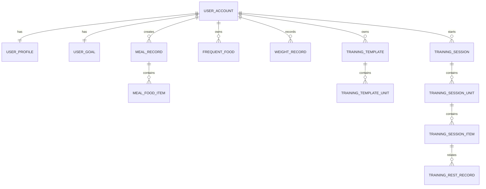

## 6. 数据表总览

### 6.1 user_account

用途：保存微信登录账户。

| 字段 | 说明 |
|---|---|
| id | 主键 |
| user_id | 系统用户 ID |
| openid | 微信小程序 openid |
| unionid | 微信 unionid |
| status | normal/disabled/deleted |
| last_login_at | 最近登录时间 |
| created_at | 创建时间 |
| updated_at | 更新时间 |

### 6.2 user_profile

用途：保存用户基础资料。

| 字段 | 说明 |
|---|---|
| id | 主键 |
| user_id | 用户 ID |
| nickname | 昵称 |
| avatar_url | 头像 |
| gender | male/female/unknown |
| birth_year | 出生年份 |
| height_cm | 身高 |
| current_weight_kg | 当前体重 |
| created_at | 创建时间 |
| updated_at | 更新时间 |

### 6.3 user_goal

用途：保存当前目标。

| 字段 | 说明 |
|---|---|
| id | 目标 ID |
| user_id | 用户 ID |
| goal_stage | fat_loss/muscle_gain |
| calorie_target | 每日热量目标 |
| protein_target | 每日蛋白质目标 |
| target_weight_kg | 目标体重 |
| goal_status | active/archived |
| created_at | 创建时间 |
| updated_at | 更新时间 |

### 6.4 meal_record

用途：保存一次饮食记录主信息。

| 字段 | 说明 |
|---|---|
| id | 饮食记录 ID |
| user_id | 用户 ID |
| record_date | 记录日期 |
| record_time | 具体时间 |
| meal_type | breakfast/lunch/dinner/snack |
| source_type | photo_ai/manual_search/frequent_food/custom |
| total_calorie | 本次总热量 |
| total_protein | 本次总蛋白质 |
| total_carb | 本次总碳水 |
| total_fat | 本次总脂肪 |
| status | draft/confirmed/revoked/deleted |
| is_saved_as_frequent | 是否保存为常吃 |
| created_at | 创建时间 |
| updated_at | 更新时间 |

### 6.5 meal_food_item

用途：保存饮食记录中的食物明细。

| 字段 | 说明 |
|---|---|
| id | 明细 ID |
| meal_record_id | 所属饮食记录 |
| user_id | 用户 ID |
| food_name | 食物名称 |
| food_category | 食物分类 |
| portion_desc | 份量描述 |
| weight_g | 克数 |
| calorie | 热量 |
| protein | 蛋白质 |
| carb | 碳水 |
| fat | 脂肪 |
| data_source | ai/standard_db/user_custom/frequent |
| is_user_modified | 是否用户修改 |
| is_deleted | 是否删除 |
| created_at | 创建时间 |
| updated_at | 更新时间 |

### 6.6 frequent_food

用途：保存用户个人常吃食物。

| 字段 | 说明 |
|---|---|
| id | 常吃食物 ID |
| user_id | 用户 ID |
| food_name | 食物名称 |
| default_portion_desc | 默认份量 |
| default_weight_g | 默认克数 |
| calorie | 默认热量 |
| protein | 默认蛋白质 |
| carb | 默认碳水 |
| fat | 默认脂肪 |
| source_type | ai_saved/custom/manual |
| use_count | 使用次数 |
| last_used_at | 最近使用时间 |
| status | active/deleted |
| created_at | 创建时间 |
| updated_at | 更新时间 |

### 6.7 food_database

用途：保存基础食物营养数据。

| 字段 | 说明 |
|---|---|
| id | 食物库 ID |
| food_name | 食物名称 |
| alias_names | 别名 |
| category | 分类 |
| calorie_per_100g | 每 100g 热量 |
| protein_per_100g | 每 100g 蛋白质 |
| carb_per_100g | 每 100g 碳水 |
| fat_per_100g | 每 100g 脂肪 |
| source | 数据来源 |
| status | active/disabled |
| created_at | 创建时间 |
| updated_at | 更新时间 |

### 6.8 weight_record

用途：保存体重历史。

| 字段 | 说明 |
|---|---|
| id | 体重记录 ID |
| user_id | 用户 ID |
| weight_kg | 体重 |
| record_time | 记录时间 |
| record_date | 记录日期 |
| note | 备注 |
| status | normal/deleted |
| created_at | 创建时间 |
| updated_at | 更新时间 |

### 6.9 training_template

用途：保存训练模板。

| 字段 | 说明 |
|---|---|
| id | 模板 ID |
| user_id | 用户 ID |
| template_name | 模板名称 |
| description | 描述 |
| goal_type | fat_loss/muscle_gain/strength/other |
| status | active/deleted |
| created_at | 创建时间 |
| updated_at | 更新时间 |

### 6.10 training_template_unit

用途：保存模板训练单元。

| 字段 | 说明 |
|---|---|
| id | 模板单元 ID |
| template_id | 模板 ID |
| user_id | 用户 ID |
| unit_type | normal/superset/dropset |
| unit_name | 单元名称 |
| sort_order | 排序 |
| config_json | 单元配置 |
| created_at | 创建时间 |
| updated_at | 更新时间 |

### 6.11 training_session

用途：保存一次训练会话。

| 字段 | 说明 |
|---|---|
| id | 训练会话 ID |
| user_id | 用户 ID |
| template_id | 来源模板 ID |
| template_name_snapshot | 模板名称快照 |
| session_status | draft/in_progress/resting/completed/interrupted_saved/abandoned |
| start_time | 开始时间 |
| end_time | 结束时间 |
| duration_seconds | 训练总时长 |
| current_unit_id | 当前训练单元 |
| current_item_id | 当前训练项 |
| is_snapshot | 是否快照 |
| created_at | 创建时间 |
| updated_at | 更新时间 |

### 6.12 training_session_unit

用途：保存本次训练快照中的训练单元。

| 字段 | 说明 |
|---|---|
| id | 会话单元 ID |
| session_id | 所属训练会话 |
| user_id | 用户 ID |
| unit_type | normal/superset/dropset |
| unit_name | 单元名称快照 |
| sort_order | 排序 |
| status | not_started/in_progress/completed/skipped/unfinished |
| created_at | 创建时间 |
| updated_at | 更新时间 |

### 6.13 training_session_item

用途：保存具体训练执行项。

| 字段 | 说明 |
|---|---|
| id | 明细 ID |
| session_id | 训练会话 ID |
| session_unit_id | 训练单元 ID |
| user_id | 用户 ID |
| exercise_name | 动作名称 |
| round_index | 超级组或递减组轮次 |
| set_index | 普通动作组序号 |
| segment_index | 递减组重量段序号 |
| target_weight | 目标重量 |
| target_reps | 目标次数 |
| actual_weight | 实际重量 |
| actual_reps | 实际次数 |
| target_rest_seconds | 目标休息秒数 |
| actual_rest_seconds | 实际休息秒数 |
| status | not_started/in_progress/completed/skipped/unfinished |
| is_temporary_added | 是否临时加组 |
| completed_at | 完成时间 |
| created_at | 创建时间 |
| updated_at | 更新时间 |

### 6.14 training_rest_record

用途：保存每一次休息记录。

| 字段 | 说明 |
|---|---|
| id | 休息记录 ID |
| session_id | 训练会话 ID |
| user_id | 用户 ID |
| related_item_id | 关联完成的训练项 |
| planned_rest_seconds | 计划休息秒数 |
| rest_start_time | 休息开始时间 |
| rest_target_end_time | 计划结束时间 |
| rest_actual_end_time | 实际结束时间 |
| actual_rest_seconds | 实际休息秒数 |
| end_type | natural_end/skipped/extended |
| created_at | 创建时间 |
| updated_at | 更新时间 |

## 7. 接口总览

### 7.1 认证与用户

| 接口 | 方法 | 说明 |
|---|---|---|
| `/api/auth/wechat-login` | POST | 微信登录 |
| `/api/user/profile` | GET | 查询用户资料 |
| `/api/user/profile` | PUT | 更新用户资料 |
| `/api/user/goal` | GET | 查询当前目标 |
| `/api/user/goal` | PUT | 创建或更新目标 |

### 7.2 首页

| 接口 | 方法 | 说明 |
|---|---|---|
| `/api/home/dashboard?date=YYYY-MM-DD` | GET | 查询首页聚合数据 |

### 7.3 饮食

| 接口 | 方法 | 说明 |
|---|---|---|
| `/api/diet/recognize` | POST | 图片识别 |
| `/api/diet/foods/search` | GET | 搜索食物 |
| `/api/diet/records/confirm` | POST | 确认饮食记录 |
| `/api/diet/records` | GET | 查询饮食记录 |
| `/api/diet/records/{record_id}` | PUT | 编辑饮食 |
| `/api/diet/records/{record_id}` | DELETE | 删除饮食 |
| `/api/diet/records/{record_id}/revoke` | POST | 撤销饮食 |
| `/api/diet/frequent-foods` | GET | 常吃食物列表 |
| `/api/diet/frequent-foods` | POST | 新增常吃食物 |
| `/api/diet/frequent-foods/{food_id}` | DELETE | 删除常吃食物 |

### 7.4 体重

| 接口 | 方法 | 说明 |
|---|---|---|
| `/api/weight/records` | POST | 新增体重 |
| `/api/weight/records` | GET | 查询体重列表 |
| `/api/weight/records/{record_id}` | PUT | 编辑体重 |
| `/api/weight/records/{record_id}` | DELETE | 删除体重 |
| `/api/weight/trend?range=7d` | GET | 7 天趋势 |
| `/api/weight/trend?range=30d` | GET | 30 天趋势 |

### 7.5 训练

| 接口 | 方法 | 说明 |
|---|---|---|
| `/api/training/templates` | POST | 创建模板 |
| `/api/training/templates` | GET | 模板列表 |
| `/api/training/templates/{template_id}` | GET | 模板详情 |
| `/api/training/templates/{template_id}` | PUT | 更新模板 |
| `/api/training/templates/{template_id}` | DELETE | 删除模板 |
| `/api/training/sessions/start` | POST | 开始训练 |
| `/api/training/sessions/unfinished` | GET | 未完成训练 |
| `/api/training/sessions/{session_id}` | GET | 训练会话详情 |
| `/api/training/sessions/{session_id}/items/{item_id}/complete` | POST | 完成当前项 |
| `/api/training/sessions/{session_id}/items/{item_id}/skip` | POST | 跳过当前项 |
| `/api/training/sessions/{session_id}/rest/{rest_id}/skip` | POST | 跳过休息 |
| `/api/training/sessions/{session_id}/rest/{rest_id}/extend` | POST | 延长休息 |
| `/api/training/sessions/{session_id}/items/add-temp-set` | POST | 临时加组 |
| `/api/training/sessions/{session_id}/finish` | POST | 结束训练 |
| `/api/training/sessions/history` | GET | 训练历史 |
| `/api/training/sessions/{session_id}/history-detail` | GET | 历史详情 |

## 8. 首页聚合规则

### 8.1 饮食统计

统计：

- 当前用户；
- 指定日期；
- meal_record.status = confirmed。

不统计：

- draft；
- revoked；
- deleted。

### 8.2 训练状态

优先级：

1. 存在 in_progress 或 resting：进行中；
2. 当天存在 completed：已完成；
3. 当天存在 interrupted_saved：中断保存；
4. 否则：未开始。

本周训练次数统计 completed 和 interrupted_saved，不统计 abandoned。

### 8.3 体重展示

优先级：

1. 当天最新 normal 体重记录；
2. 最近一次历史体重；
3. user_profile.current_weight_kg；
4. 空状态。

## 9. 权限与安全

1. 除登录接口外，所有接口必须校验 token。
2. 后端通过 token 解析 user_id，不信任前端传入 user_id。
3. 用户不能访问其他用户数据。
4. 通过 record_id 查询时必须校验数据归属。
5. 日志中不应完整打印 token、openid、身体数据、饮食明细、体重历史。

## 10. 错误码建议

| 错误码 | 说明 |
|---:|---|
| 0 | 成功 |
| 40001 | 登录已失效 |
| 40002 | 无权限访问 |
| 40003 | 参数错误 |
| 40004 | 数据不存在 |
| 40005 | 数据状态不允许操作 |
| 41001 | 饮食识别失败 |
| 41002 | 食物库无匹配结果 |
| 42001 | 存在未完成训练 |
| 42002 | 训练会话不存在 |
| 42003 | 当前训练项状态异常 |
| 43001 | 体重数值不合法 |
| 44001 | 目标设置不完整 |
| 50000 | 系统异常 |

## 11. 统一响应格式

成功：

```json
{
  "code": 0,
  "message": "success",
  "data": {}
}
```

失败：

```json
{
  "code": 40003,
  "message": "参数错误",
  "data": {
    "field": "calorie_target",
    "reason": "每日热量目标必须大于 0"
  }
}
```

分页：

```json
{
  "code": 0,
  "message": "success",
  "data": {
    "list": [],
    "page": 1,
    "page_size": 20,
    "total": 100,
    "has_more": true
  }
}
```

## 12. 后端分层建议

```text
controller 层：处理请求和响应
service 层：处理业务逻辑
repository / dao 层：处理数据库访问
adapter 层：封装第三方 AI 食物识别服务
common 层：鉴权、错误码、工具函数
```

建议服务：

- AuthService；
- UserService；
- HomeDashboardService；
- DietService；
- DietStatsService；
- FoodRecognitionAdapter；
- WeightService；
- TrainingTemplateService；
- TrainingSessionService。

## 13. MVP 验收标准

1. 所有业务表均包含 user_id。
2. 用户数据可以按 user_id 隔离。
3. 首页数据通过统一聚合接口返回。
4. 饮食记录支持一条主记录多条明细。
5. AI 识别结果确认后才入库。
6. 体重记录支持同一天多条。
7. 训练模板和训练记录分离。
8. 开始训练时生成训练快照。
9. 历史训练不受模板修改影响。
10. 未登录不能访问业务接口。
11. 用户不能访问其他用户数据。
12. 新增、编辑、删除数据后首页统计一致。
