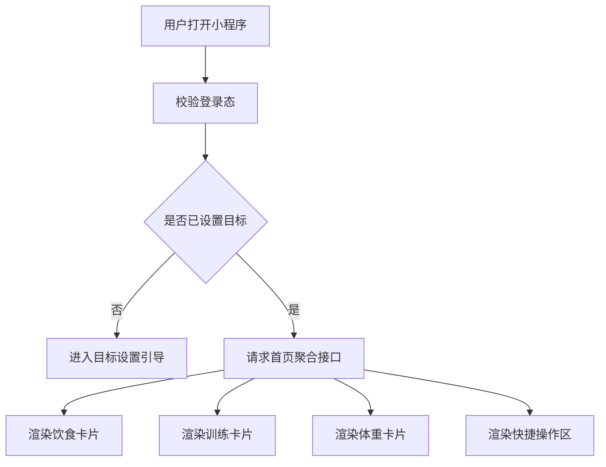
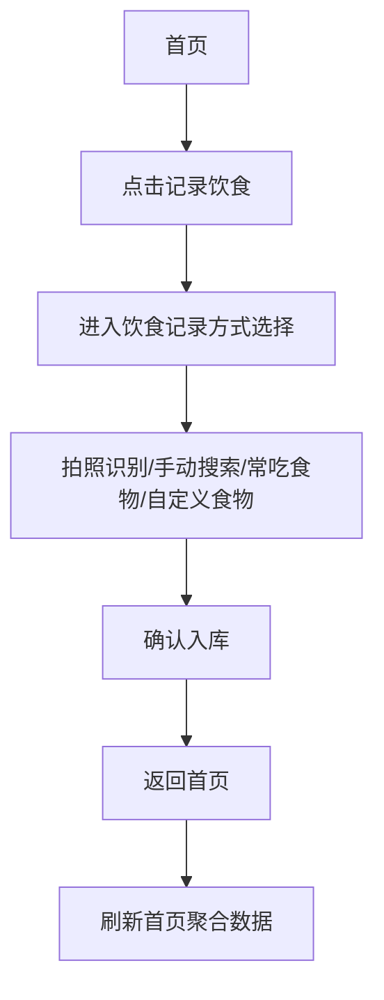
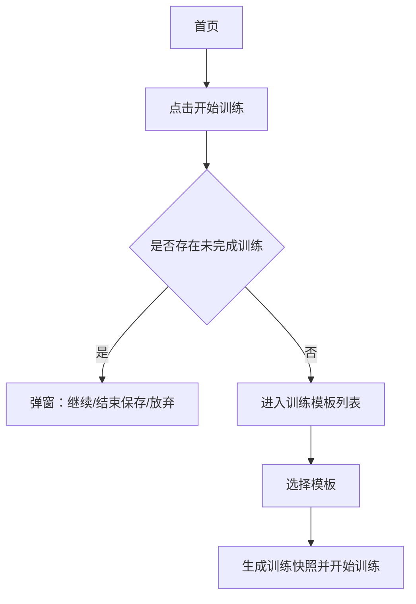
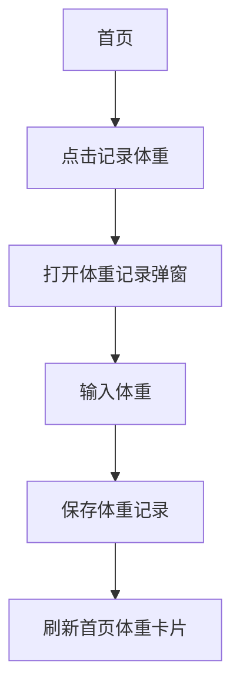

# 首页看板模块 PRD

## 1. 模块定位

首页看板是用户进入小程序后的核心总览页面，用于聚合展示当天饮食、训练、体重和目标完成情况，并提供高频操作入口。

首页第一版不承担复杂分析职责，重点是让用户快速判断：

- 今日热量是否超标；
- 今日蛋白质是否达标；
- 今日是否完成训练；
- 当前体重距离目标还有多少；
- 接下来应该记录饮食、开始训练还是记录体重。

## 2. 功能目标

### 2.1 用户目标

用户打开小程序后，可以在 3 秒内了解今天的执行情况，并快速进入饮食记录、训练执行或体重记录。

### 2.2 产品目标

通过首页看板形成每日使用闭环，提高用户饮食记录、训练记录和体重记录频率。

### 2.3 数据目标

为后续周报、月报、饮食与体重关联分析、训练与体重关联分析沉淀基础数据。

## 3. 前置条件

1. 用户已完成微信登录。
2. 用户已设置基础目标：
   - 当前阶段：减脂 / 增肌；
   - 每日热量目标；
   - 每日蛋白质目标；
   - 目标体重。
3. 系统可以读取当前用户的：
   - 饮食记录；
   - 训练记录；
   - 体重记录；
   - 训练模板；
   - 未完成训练状态。

## 4. 页面结构

首页建议采用卡片式布局，包含以下区域：

1. 今日饮食卡片；
2. 今日训练卡片；
3. 体重状态卡片；
4. 快捷操作区。

## 5. 今日饮食卡片

### 5.1 展示内容

| 字段 | 说明 |
|---|---|
| 今日摄入热量 | 当天所有已确认饮食记录的热量总和 |
| 每日热量目标 | 用户目标设置中的热量目标 |
| 剩余热量 / 超出热量 | 每日热量目标 - 今日摄入热量 |
| 今日蛋白质摄入 | 当天所有已确认饮食记录的蛋白质总和 |
| 每日蛋白质目标 | 用户目标设置中的蛋白质目标 |
| 蛋白质完成率 | 今日蛋白质摄入 / 每日蛋白质目标 |

### 5.2 操作入口

- 记录饮食；
- 查看今日饮食。

### 5.3 交互规则

1. 点击“记录饮食”进入饮食记录方式选择页。
2. 点击“查看今日饮食”进入饮食详情页。
3. 新增、编辑、删除、撤销饮食记录后，首页饮食卡片需刷新。
4. 未设置目标时，只展示摄入值，不展示完成率，并引导设置目标。

## 6. 今日训练卡片

### 6.1 展示内容

| 字段 | 说明 |
|---|---|
| 今日训练状态 | 未开始 / 进行中 / 已完成 / 中断保存 |
| 本周训练次数 | 当前自然周内已完成或中断保存的训练次数 |
| 最近训练模板 | 最近一次使用的训练模板 |
| 未完成训练 | 是否存在进行中的训练会话 |

### 6.2 训练状态规则

| 状态 | 判断规则 |
|---|---|
| 未开始 | 当天无训练记录，且无未完成训练 |
| 进行中 | 存在 in_progress 或 resting 状态训练会话 |
| 已完成 | 当天存在 completed 状态训练记录 |
| 中断保存 | 当天存在 interrupted_saved 状态训练记录 |

### 6.3 操作入口

- 未训练：显示“开始训练”；
- 存在未完成训练：显示“继续训练”；
- 已完成训练：显示“查看训练记录”。

### 6.4 未完成训练弹窗

点击“继续训练”后弹窗展示：

1. 继续训练；
2. 结束并保存；
3. 放弃本次训练。

## 7. 体重状态卡片

### 7.1 展示内容

| 字段 | 说明 |
|---|---|
| 最新体重 | 当天最新体重或最近一次历史体重 |
| 记录时间 | 体重记录时间 |
| 目标体重 | 用户设置的目标体重 |
| 距离目标 | 当前展示体重 - 目标体重 |

### 7.2 展示优先级

1. 当天最新体重记录；
2. 最近一次历史体重记录；
3. 用户基础信息中的当前体重；
4. 空状态。

### 7.3 操作入口

- 记录体重；
- 查看趋势。

## 8. 快捷操作区

首页提供三个核心按钮：

| 按钮 | 跳转 |
|---|---|
| 记录饮食 | 饮食记录方式选择页 |
| 开始训练 | 训练模板列表页 / 未完成训练处理弹窗 |
| 记录体重 | 体重记录弹窗或体重页面 |

## 9. 核心流程

### 9.1 首页加载流程



### 9.2 记录饮食流程入口



### 9.3 开始训练流程入口



### 9.4 记录体重流程入口



## 10. 字段定义

### 10.1 首页聚合数据

| 字段名 | 类型 | 必填 | 说明 |
|---|---|---|---|
| user_id | string | 是 | 当前用户 ID |
| stat_date | date | 是 | 统计日期 |
| calorie_target | number | 是 | 每日热量目标 |
| protein_target | number | 是 | 每日蛋白质目标 |
| calorie_intake | number | 是 | 今日摄入热量 |
| protein_intake | number | 是 | 今日摄入蛋白质 |
| carb_intake | number | 否 | 今日碳水 |
| fat_intake | number | 否 | 今日脂肪 |
| training_status | enum | 是 | 今日训练状态 |
| weekly_training_count | number | 是 | 本周训练次数 |
| latest_weight | number | 否 | 最新体重 |
| target_weight | number | 否 | 目标体重 |
| target_diff | number | 否 | 目标差距 |

## 11. 空状态

### 11.1 未设置目标

文案：

> 先设置你的每日目标，开始管理饮食和训练。

按钮：

- 去设置目标。

### 11.2 今日无饮食记录

文案：

> 今天还没有记录饮食。

按钮：

- 记录第一餐。

### 11.3 今日无训练记录

文案：

> 今天还没有训练记录。

按钮：

- 开始训练。

### 11.4 无体重记录

文案：

> 记录体重后，可以查看减脂趋势。

按钮：

- 记录体重。

## 12. 验收标准

1. 用户登录后可以进入首页。
2. 首页可以展示今日热量和目标热量。
3. 首页可以展示今日蛋白质和蛋白质目标。
4. 首页可以展示今日训练状态。
5. 首页可以展示本周训练次数。
6. 首页可以展示最新体重和目标体重差距。
7. 首页提供记录饮食、开始训练、记录体重入口。
8. 新增饮食后首页热量和蛋白质更新。
9. 完成训练后首页训练状态更新。
10. 新增体重后首页体重数据更新。
11. 存在未完成训练时首页展示继续训练入口。
12. 首页接口请求失败时展示重试入口，不白屏。

## 13. 技术实现建议

### 13.1 前端

前端为微信小程序首页页面，建议在 `onShow` 中请求首页聚合接口，以保证从其他页面返回时数据刷新。

### 13.2 后端

建议提供统一聚合接口：

```http
GET /api/home/dashboard?date=YYYY-MM-DD
```

后端统一聚合：

- 用户目标；
- 今日饮食汇总；
- 今日训练状态；
- 本周训练次数；
- 最新体重；
- 未完成训练状态。

### 13.3 数据一致性

首页不应由前端分别请求饮食、训练、体重后自行拼装统计。首页展示以服务端聚合结果为准。
