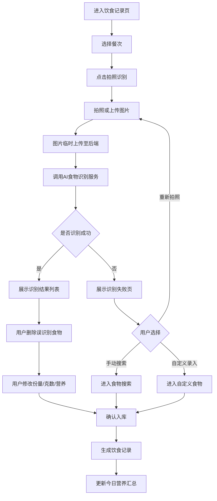

# 饮食记录模块 PRD

## 1. 模块定位

饮食记录模块用于帮助用户记录每日饮食摄入，并自动汇总热量、蛋白质、碳水、脂肪等营养数据。

MVP 阶段核心定位：

> 通过 AI 拍照识别降低录入成本，通过用户确认和修正确保数据可靠。

AI 识别不直接入库，所有结果必须由用户确认后才计入统计。

## 2. MVP 功能范围

第一版实现：

1. 拍照识别饮食；
2. 手动搜索食物；
3. 常吃食物快速记录；
4. 自定义食物；
5. 用户确认后入库；
6. 修改食物名称、份量、克数、营养数据；
7. 删除单个识别结果；
8. 撤销最近一次记录；
9. 编辑 / 删除任意饮食记录；
10. 保存为常吃食物；
11. 早餐 / 午餐 / 晚餐 / 加餐分类；
12. 自动统计每日热量、蛋白质、碳水、脂肪。

## 3. 非本期范围

MVP 阶段不做：

- 自动精准称重；
- 自动拆分复杂菜品真实重量；
- 条形码识别；
- 外卖订单导入；
- AI 自动生成减脂餐单；
- 饮食图片长期保存；
- 微量营养素统计；
- 饮水记录；
- 膳食纤维统计；
- 智能设备同步。

## 4. 核心原则

### 4.1 AI 只做辅助

AI 识别结果必须进入待确认状态。用户点击“确认记录”后，才生成正式饮食记录。

### 4.2 用户确认数据为最终数据

统计以用户确认后的食物名称、克数、热量和营养素为准。

### 4.3 不保存饮食图片

MVP 不保存原图，也不保存压缩图。图片只用于本次识别流程，后端处理后应删除临时文件。

### 4.4 支持低成本纠错

用户至少可以修改：

- 食物名称；
- 份量；
- 克数；
- 热量；
- 蛋白质；
- 碳水；
- 脂肪；
- 餐次；
- 记录时间。

## 5. 页面入口

1. 首页点击“记录饮食”；
2. 饮食页点击“记录饮食”；
3. 常吃食物页点击某个常吃食物；
4. 记录成功页点击“继续记录”。

## 6. 餐次定义

| 餐次 | 枚举值 | 说明 |
|---|---|---|
| 早餐 | breakfast | 早餐记录 |
| 午餐 | lunch | 午餐记录 |
| 晚餐 | dinner | 晚餐记录 |
| 加餐 | snack | 零食、饮料、夜宵、训练前后加餐 |

默认餐次可按当前时间推荐，但用户必须可以手动修改。

建议默认规则：

| 时间段 | 默认餐次 |
|---|---|
| 05:00–10:30 | 早餐 |
| 10:31–14:30 | 午餐 |
| 14:31–20:30 | 晚餐 |
| 20:31–04:59 | 加餐 |

## 7. 拍照识别流程

### 7.1 操作步骤

1. 用户点击“记录饮食”。
2. 选择餐次。
3. 点击“拍照识别”。
4. 拍照或从相册选择图片。
5. 前端将图片临时上传到后端。
6. 后端调用第三方 AI 食物识别服务。
7. AI 返回识别结果。
8. 前端展示识别出的食物列表。
9. 用户删除误识别食物。
10. 用户修改名称、份量、克数、营养数据。
11. 用户点击“确认记录”。
12. 系统生成正式饮食记录。
13. 首页饮食统计更新。

### 7.2 流程图



### 7.3 识别结果页展示字段

每个食物展示：

| 字段 | 说明 |
|---|---|
| 食物名称 | AI 识别或用户修改后的名称 |
| 份量 | 例如 1 碗、1 个、半份 |
| 克数 | 用于营养计算 |
| 热量 | 本次食物热量 |
| 蛋白质 | 本次食物蛋白质 |
| 碳水 | 本次食物碳水 |
| 脂肪 | 本次食物脂肪 |
| 编辑按钮 | 修改食物信息 |
| 删除按钮 | 删除误识别项 |

页面底部展示：

- 本次总热量；
- 本次总蛋白质；
- 确认记录按钮；
- 保存为常吃食物选项。

## 8. 识别失败处理

识别失败时展示文案：

> 这张图片暂时无法准确识别。你可以重新拍照，或通过手动搜索 / 自定义录入完成记录。

提供入口：

1. 重新拍照；
2. 手动搜索；
3. 自定义录入。

## 9. 手动搜索食物流程

### 9.1 操作步骤

1. 用户选择“手动搜索”。
2. 选择餐次。
3. 输入食物关键词。
4. 系统搜索标准食物库和常吃食物。
5. 用户选择目标食物。
6. 系统带出每 100g 营养数据。
7. 用户输入份量或克数。
8. 系统换算本次营养值。
9. 用户确认入库。
10. 首页统计更新。

### 9.2 搜索结果字段

| 字段 | 说明 |
|---|---|
| 食物名称 | 如鸡蛋、米饭、鸡胸肉 |
| 分类 | 主食、肉类、蔬菜、水果等 |
| 每100g热量 | kcal |
| 每100g蛋白质 | g |
| 每100g碳水 | g |
| 每100g脂肪 | g |
| 来源 | 标准库 / 常吃食物 |

## 10. 常吃食物流程

### 10.1 来源

常吃食物来源包括：

1. 用户手动创建；
2. AI 识别后用户勾选“保存为常吃”；
3. 自定义食物保存为常吃。

### 10.2 操作步骤

1. 用户进入常吃食物列表。
2. 选择某个常吃食物。
3. 系统带出默认份量、克数和营养数据。
4. 用户按本次情况修改。
5. 用户确认入库。
6. 系统生成饮食记录。

### 10.3 规则

1. 常吃食物只对当前用户可见。
2. 第一版不做高频自动推荐。
3. 删除常吃食物不影响历史饮食记录。

## 11. 自定义食物流程

### 11.1 操作步骤

1. 用户进入自定义食物页面。
2. 输入食物名称。
3. 输入克数。
4. 输入热量。
5. 输入蛋白质、碳水、脂肪。
6. 选择餐次。
7. 选择是否保存为常吃食物。
8. 确认入库。

### 11.2 必填字段

| 字段 | 规则 |
|---|---|
| 食物名称 | 必填，最多 30 字 |
| 克数 | 必填，必须大于 0 |
| 热量 | 必填，必须大于等于 0 |
| 蛋白质 | 选填，必须大于等于 0 |
| 碳水 | 选填，必须大于等于 0 |
| 脂肪 | 选填，必须大于等于 0 |

## 12. 饮食记录编辑、删除、撤销

### 12.1 编辑

可编辑字段：

- 餐次；
- 记录时间；
- 食物名称；
- 份量；
- 克数；
- 热量；
- 蛋白质；
- 碳水；
- 脂肪。

编辑后重新计算该日期饮食汇总。

### 12.2 删除

删除采用软删除。删除后：

1. 不再展示；
2. 不计入统计；
3. 重新计算对应日期营养汇总。

### 12.3 撤销

最近一次新增饮食记录支持快捷撤销。撤销后该记录状态为 revoked，不计入统计。

## 13. 营养计算规则

如果食物库提供每 100g 营养数据：

```text
本次营养值 = 每100g营养值 × 本次克数 / 100
```

需要计算：

- 热量；
- 蛋白质；
- 碳水；
- 脂肪。

最终统计以用户确认后的克数和营养数据为准。

## 14. 数据字段

### 14.1 meal_record

| 字段名 | 类型 | 说明 |
|---|---|---|
| id | string | 饮食记录 ID |
| user_id | string | 用户 ID |
| record_date | date | 记录日期 |
| record_time | datetime | 具体时间 |
| meal_type | enum | breakfast/lunch/dinner/snack |
| source_type | enum | photo_ai/manual_search/frequent_food/custom |
| total_calorie | number | 本次总热量 |
| total_protein | number | 本次总蛋白质 |
| total_carb | number | 本次总碳水 |
| total_fat | number | 本次总脂肪 |
| status | enum | draft/confirmed/revoked/deleted |
| is_saved_as_frequent | boolean | 是否保存为常吃 |
| created_at | datetime | 创建时间 |
| updated_at | datetime | 更新时间 |

### 14.2 meal_food_item

| 字段名 | 类型 | 说明 |
|---|---|---|
| id | string | 明细 ID |
| meal_record_id | string | 所属饮食记录 |
| user_id | string | 用户 ID |
| food_name | string | 食物名称 |
| food_category | string | 食物分类 |
| portion_desc | string | 份量描述 |
| weight_g | number | 克数 |
| calorie | number | 热量 |
| protein | number | 蛋白质 |
| carb | number | 碳水 |
| fat | number | 脂肪 |
| data_source | enum | ai/standard_db/user_custom/frequent |
| is_user_modified | boolean | 是否用户修改 |
| is_deleted | boolean | 是否删除 |
| created_at | datetime | 创建时间 |
| updated_at | datetime | 更新时间 |

### 14.3 frequent_food

| 字段名 | 类型 | 说明 |
|---|---|---|
| id | string | 常吃食物 ID |
| user_id | string | 用户 ID |
| food_name | string | 食物名称 |
| default_portion_desc | string | 默认份量 |
| default_weight_g | number | 默认克数 |
| calorie | number | 默认热量 |
| protein | number | 默认蛋白质 |
| carb | number | 默认碳水 |
| fat | number | 默认脂肪 |
| source_type | enum | ai_saved/custom/manual |
| use_count | number | 使用次数 |
| last_used_at | datetime | 最近使用时间 |
| status | enum | active/deleted |
| created_at | datetime | 创建时间 |
| updated_at | datetime | 更新时间 |

## 15. 接口建议

| 接口 | 方法 | 说明 |
|---|---|---|
| `/api/diet/recognize` | POST | 上传图片并识别食物 |
| `/api/diet/foods/search` | GET | 搜索标准食物和常吃食物 |
| `/api/diet/records/confirm` | POST | 确认饮食记录 |
| `/api/diet/records` | GET | 查询某日饮食记录 |
| `/api/diet/records/{record_id}` | PUT | 编辑饮食记录 |
| `/api/diet/records/{record_id}` | DELETE | 删除饮食记录 |
| `/api/diet/records/{record_id}/revoke` | POST | 撤销最近一次记录 |
| `/api/diet/frequent-foods` | GET | 查询常吃食物 |
| `/api/diet/frequent-foods` | POST | 新增常吃食物 |
| `/api/diet/frequent-foods/{food_id}` | DELETE | 删除常吃食物 |

## 16. 验收标准

1. 用户可以从首页进入饮食记录。
2. 用户可以拍照或上传图片。
3. AI 识别成功时展示食物列表。
4. AI 识别失败时展示兜底入口。
5. 用户可以删除单个识别食物。
6. 用户可以修改食物名称、份量、克数和营养数据。
7. 用户确认后生成正式饮食记录。
8. 未确认识别结果不计入首页统计。
9. 用户可以手动搜索食物。
10. 用户可以创建自定义食物。
11. 用户可以使用常吃食物。
12. 用户可以编辑、删除、撤销饮食记录。
13. 编辑、删除、撤销后首页统计同步更新。
14. 不保存饮食图片。

## 17. 技术风险

### 17.1 AI 识别准确率风险

中餐混合菜、酱料、烹饪方式、份量估算都可能导致误差。解决方式：

- AI 结果必须用户确认；
- 支持删除误识别项；
- 支持手动修改数据；
- 提供手动搜索和自定义兜底。

### 17.2 第三方 API 依赖风险

第三方服务可能失败、超时或收费变化。解决方式：

- 后端封装 FoodRecognitionAdapter；
- 前端不直接调用第三方；
- 失败后进入手动兜底；
- MVP 可先使用 mock 识别结果。
