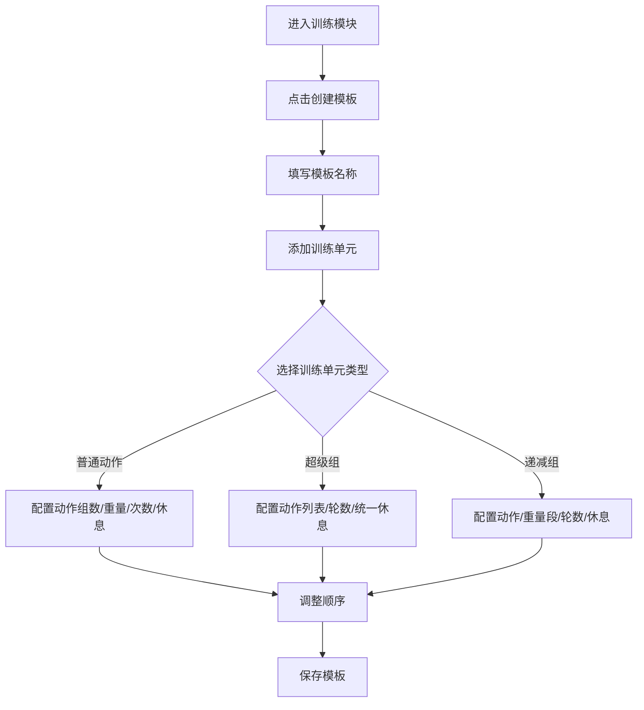
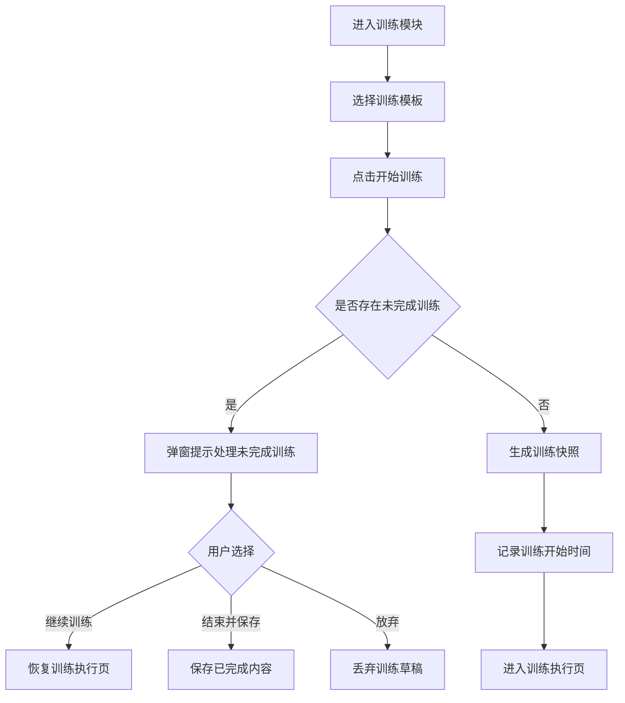

# 训练模板与训练执行模块 PRD

## 1. 模块定位

训练模块负责帮助用户创建训练计划、按计划执行训练、自动管理组间休息，并沉淀训练历史。

MVP 阶段核心体验：

> 创建训练模板 → 开始训练 → 完成本组 → 自动休息倒计时 → 进入下一组 → 完成训练 → 保存历史。

## 2. MVP 功能范围

第一版实现：

1. 创建训练模板；
2. 编辑、删除、复制训练模板；
3. 普通动作训练；
4. 每组不同重量、次数、休息时间；
5. 简化版超级组；
6. 简化版递减组；
7. 开始训练时生成模板快照；
8. 训练中修改实际重量和次数；
9. 训练中临时加组；
10. 训练中跳过动作、组或重量段；
11. 完成本组后自动进入休息倒计时；
12. 休息中跳过休息；
13. 休息中延长休息；
14. 倒计时结束提醒；
15. 训练中断恢复；
16. 完成训练并保存历史；
17. 查看训练历史。

## 3. 非本期范围

MVP 不实现：

- AI 自动生成训练计划；
- AI 推荐训练重量；
- 动作视频识别；
- 智能手表同步；
- 私教协同；
- 社区打卡；
- 高级周期化训练；
- 超级组嵌套；
- 递减组与超级组复杂混合；
- 1RM 自动计算；
- 训练容量趋势图。

## 4. 核心原则

### 4.1 模板与训练记录分离

训练模板用于未来训练安排。训练记录保存某一次真实训练结果。开始训练时必须复制模板生成训练快照。

### 4.2 历史记录不受模板修改影响

用户修改模板后，不影响已经完成的历史训练记录。

### 4.3 训练中操作要轻

训练中页面重点提供：

- 修改实际重量；
- 修改实际次数；
- 完成本组；
- 跳过；
- 跳过休息；
- 延长休息；
- 结束训练。

### 4.4 休息倒计时基于时间戳

训练休息不能只依赖前端定时器。系统应保存：

- 休息开始时间；
- 目标结束时间；
- 实际结束时间。

用户切后台或重新进入后，根据当前时间校准。

### 4.5 后台提醒不强承诺

微信小程序无法强承诺长时间后台精准响铃。MVP 承诺：

- 前台沉浸式倒计时；
- 回到小程序后自动校准休息状态；
- 后台震动/声音仅作为增强能力。

## 5. 核心概念

### 5.1 训练模板

用户预先配置的训练计划，例如：

- 胸肩三头；
- 背二头；
- 腿臀日；
- 有氧日。

### 5.2 训练单元

训练模板由多个训练单元组成。MVP 支持：

| 类型 | 说明 |
|---|---|
| 普通动作 | 单个动作，由多组组成 |
| 超级组 | 多个动作按顺序完成，全部完成后统一休息 |
| 递减组 | 同一动作多个重量段连续完成，中间不休息 |

### 5.3 训练快照

用户开始训练时，由模板复制生成的本次训练数据。后续模板修改不影响快照。

## 6. 训练模板列表页

展示：

1. 模板名称；
2. 最近使用时间；
3. 动作数量；
4. 开始训练按钮；
5. 编辑按钮；
6. 复制按钮；
7. 删除按钮。

提供：

- 创建训练模板；
- 复制上一次训练。

## 7. 创建训练模板流程

## 8. 普通动作配置

普通动作示例：

| 组 | 目标重量 | 目标次数 | 休息 |
|---|---:|---:|---:|
| 1 | 60kg | 12 | 180秒 |
| 2 | 70kg | 10 | 180秒 |
| 3 | 75kg | 8 | 180秒 |
| 4 | 80kg | 6 | 180秒 |

字段：

- 动作名称；
- 动作备注；
- 组序号；
- 每组目标重量；
- 每组目标次数；
- 每组休息时间。

## 9. 简化版超级组配置

规则：

> 多个动作按顺序完成，全部动作完成后统一休息。

示例：

超级组 A，重复 4 轮：

1. 哑铃卧推 12 次；
2. 俯卧撑 15 次；
3. 绳索夹胸 12 次；
4. 完成一轮后休息 120 秒。

字段：

- 超级组名称；
- 轮数；
- 动作列表；
- 每个动作目标重量；
- 每个动作目标次数；
- 每轮统一休息时间。

MVP 不支持：

- 超级组嵌套；
- 超级组内每个动作复杂休息；
- 超级组与递减组嵌套。

## 10. 简化版递减组配置

规则：

> 同一动作在一轮内连续完成多个重量段，中间不休息，全部完成后统一休息。

示例：

侧平举递减组，3 轮：

| 重量段 | 目标重量 | 目标次数 |
|---|---:|---:|
| 1 | 10kg | 10 |
| 2 | 7.5kg | 8 |
| 3 | 5kg | 8 |

每轮完成后休息 120 秒。

字段：

- 动作名称；
- 轮数；
- 重量段列表；
- 每段目标重量；
- 每段目标次数；
- 每轮完成后休息时间。

## 11. 开始训练流程

## 12. 训练执行页

### 12.1 展示内容

| 内容 | 说明 |
|---|---|
| 当前训练模板名称 | 如胸肩三头 |
| 当前训练单元名称 | 如卧推 / 胸部超级组 A |
| 当前动作名称 | 如卧推 |
| 当前组数 / 轮次 | 如第 2 / 4 组 |
| 目标重量 | 当前项目标重量 |
| 目标次数 | 当前项目标次数 |
| 实际重量 | 默认等于目标重量，可修改 |
| 实际次数 | 默认等于目标次数，可修改 |
| 下一项预告 | 下一组或下一动作 |
| 完成本组按钮 | 主按钮 |
| 跳过按钮 | 次按钮 |
| 临时加组按钮 | 仅普通动作支持 |
| 结束训练按钮 | 辅助入口 |

### 12.2 普通动作执行

1. 展示当前动作和当前组。
2. 用户修改实际重量或次数。
3. 点击“完成本组”。
4. 保存实际数据。
5. 如果配置休息，进入休息倒计时。
6. 否则进入下一组或下一动作。

### 12.3 超级组执行

1. 进入当前轮第一个动作。
2. 完成后进入同轮下一个动作。
3. 当前轮全部动作完成后统一休息。
4. 休息结束进入下一轮。
5. 所有轮完成后进入下一个训练单元。

超级组中允许跳过某个动作，并记录为 skipped。

### 12.4 递减组执行

1. 进入当前轮第一个重量段。
2. 完成后立即进入下一个重量段。
3. 当前轮所有重量段完成后休息。
4. 休息结束进入下一轮。
5. 所有轮完成后进入下一个训练单元。

递减组中允许跳过某个重量段，并记录为 skipped。

## 13. 休息倒计时

### 13.1 展示内容

- 剩余休息时间；
- 已完成内容；
- 下一项内容；
- 跳过休息；
- 延长休息；
- 结束训练。

### 13.2 操作

#### 跳过休息

记录实际休息时间，进入下一训练项。

#### 延长休息

固定选项：

- +30 秒；
- +60 秒；
- +120 秒。

#### 倒计时结束

触发提醒，展示“休息结束”，用户点击“开始下一组”。

## 14. 训练中断恢复

触发场景：

- 用户切到微信聊天；
- 用户锁屏；
- 用户返回桌面；
- 小程序被关闭。

恢复时：

1. 系统检查未完成训练。
2. 弹窗提示：
   - 继续训练；
   - 结束并保存；
   - 放弃本次训练。
3. 若上次状态是休息中，根据目标结束时间校准倒计时。
4. 若休息已结束，提示进入下一组。

## 15. 临时加组

规则：

1. MVP 仅普通动作支持临时加组。
2. 新组默认复制上一组重量、次数、休息时间。
3. 临时加组只进入本次训练记录。
4. 不自动修改模板。
5. 历史记录中标记 `is_temporary_added = true`。

## 16. 结束训练

点击结束训练后弹窗：

1. 结束并保存；
2. 放弃本次训练；
3. 继续训练。

规则：

- 正常完成：状态 completed，进入历史；
- 中断保存：状态 interrupted_saved，进入历史；
- 放弃：状态 abandoned，不进入历史，不计入训练次数。

## 17. 训练历史

列表展示：

- 训练日期；
- 模板名称；
- 训练状态；
- 训练时长；
- 完成组数；
- 跳过组数。

详情展示：

- 每个训练单元；
- 每个动作；
- 目标重量 / 实际重量；
- 目标次数 / 实际次数；
- 实际休息时间；
- 跳过项；
- 临时加组。

## 18. 数据字段

### 18.1 training_template

| 字段 | 说明 |
|---|---|
| id | 模板 ID |
| user_id | 用户 ID |
| template_name | 模板名称 |
| description | 描述 |
| goal_type | fat_loss/muscle_gain/strength/other |
| status | active/deleted |
| created_at | 创建时间 |
| updated_at | 更新时间 |

### 18.2 training_template_unit

| 字段 | 说明 |
|---|---|
| id | 模板单元 ID |
| template_id | 模板 ID |
| user_id | 用户 ID |
| unit_type | normal/superset/dropset |
| unit_name | 单元名称 |
| sort_order | 排序 |
| config_json | 单元配置 |
| created_at | 创建时间 |
| updated_at | 更新时间 |

### 18.3 training_session

| 字段 | 说明 |
|---|---|
| id | 训练会话 ID |
| user_id | 用户 ID |
| template_id | 来源模板 |
| template_name_snapshot | 模板名称快照 |
| session_status | draft/in_progress/resting/completed/interrupted_saved/abandoned |
| start_time | 开始时间 |
| end_time | 结束时间 |
| duration_seconds | 总时长 |
| current_unit_id | 当前单元 |
| current_item_id | 当前项 |
| is_snapshot | 是否快照 |
| created_at | 创建时间 |
| updated_at | 更新时间 |

### 18.4 training_session_item

| 字段 | 说明 |
|---|---|
| id | 执行项 ID |
| session_id | 会话 ID |
| session_unit_id | 会话单元 ID |
| user_id | 用户 ID |
| exercise_name | 动作名称 |
| round_index | 超级组或递减组轮次 |
| set_index | 普通动作组序号 |
| segment_index | 递减组重量段序号 |
| target_weight | 目标重量 |
| target_reps | 目标次数 |
| actual_weight | 实际重量 |
| actual_reps | 实际次数 |
| target_rest_seconds | 目标休息 |
| actual_rest_seconds | 实际休息 |
| status | not_started/in_progress/completed/skipped/unfinished |
| is_temporary_added | 是否临时加组 |
| completed_at | 完成时间 |

## 19. 接口建议

| 接口 | 方法 | 说明 |
|---|---|---|
| `/api/training/templates` | POST | 创建模板 |
| `/api/training/templates` | GET | 模板列表 |
| `/api/training/templates/{template_id}` | GET | 模板详情 |
| `/api/training/templates/{template_id}` | PUT | 更新模板 |
| `/api/training/templates/{template_id}` | DELETE | 删除模板 |
| `/api/training/sessions/start` | POST | 开始训练 |
| `/api/training/sessions/unfinished` | GET | 查询未完成训练 |
| `/api/training/sessions/{session_id}` | GET | 训练会话详情 |
| `/api/training/sessions/{session_id}/items/{item_id}/complete` | POST | 完成当前项 |
| `/api/training/sessions/{session_id}/items/{item_id}/skip` | POST | 跳过当前项 |
| `/api/training/sessions/{session_id}/rest/{rest_id}/skip` | POST | 跳过休息 |
| `/api/training/sessions/{session_id}/rest/{rest_id}/extend` | POST | 延长休息 |
| `/api/training/sessions/{session_id}/items/add-temp-set` | POST | 临时加组 |
| `/api/training/sessions/{session_id}/finish` | POST | 结束训练 |
| `/api/training/sessions/history` | GET | 训练历史 |
| `/api/training/sessions/{session_id}/history-detail` | GET | 历史详情 |

## 20. 验收标准

1. 用户可以创建普通动作模板。
2. 普通动作支持每组不同重量、次数、休息时间。
3. 用户可以创建简化版超级组。
4. 用户可以创建简化版递减组。
5. 用户可以编辑、复制、删除模板。
6. 开始训练时生成训练快照。
7. 模板修改不影响历史训练记录。
8. 训练执行页展示当前动作、组、目标重量、目标次数。
9. 用户可以修改实际重量和次数。
10. 完成当前项后自动进入休息倒计时。
11. 用户可以跳过休息和延长休息。
12. 用户可以跳过训练项并记录 skipped。
13. 用户可以临时加组。
14. 用户退出后重新进入可以恢复训练。
15. 完成训练后生成训练历史。
16. 放弃训练不进入历史。

## 21. 技术风险

### 21.1 后台计时风险

微信小程序后台计时不可靠，不能承诺长时间后台精准响铃。处理方式：

- 服务端保存休息开始时间和目标结束时间；
- 前台倒计时只做 UI；
- 回到小程序后按时间戳校准。

### 21.2 训练结构复杂风险

普通组、超级组、递减组结构不同。处理方式：

- 使用 unit_type 统一建模；
- 执行层统一拆解为 session_item；
- 历史保存快照。
