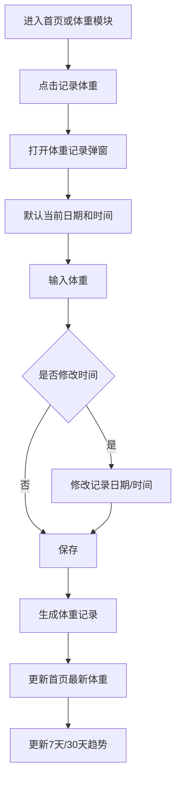

# 体重记录模块 PRD

## 1. 模块定位

体重记录模块用于记录用户在减脂或增肌周期中的体重变化，并将体重数据与首页看板、目标体重和趋势分析打通。

MVP 阶段核心定位：

> 低成本记录体重，展示近期趋势，帮助用户判断减脂或增肌执行效果。

## 2. MVP 功能范围

第一版实现：

1. 记录体重；
2. 自动记录当前时间；
3. 支持手动修改记录时间；
4. 同一天允许多条体重记录；
5. 首页展示当天最新体重；
6. 当天无记录时首页展示最近一次历史体重；
7. 历史体重列表；
8. 编辑体重记录；
9. 删除体重记录；
10. 最近 7 天趋势；
11. 最近 30 天趋势；
12. 目标体重差距展示。

## 3. 非本期范围

MVP 不实现：

- 体脂率记录；
- 肌肉量记录；
- 骨骼肌记录；
- 水分率记录；
- BMI 自动分析；
- 基础代谢计算；
- 智能体脂秤同步；
- 围度记录；
- 体型照片；
- 周报 / 月报；
- AI 体重变化建议。

## 4. 核心原则

### 4.1 同一天允许多次记录

用户可能早晚称重，也可能录错后重新记录。因此允许同一天多条记录。

### 4.2 首页展示当天最新体重

如果当天有多条体重，首页展示当天最新一条。当天没有记录时，展示最近一次历史记录。

### 4.3 趋势图使用每日最新体重

为了避免趋势混乱，7 天和 30 天趋势默认按每日最新体重作为当天统计点。

### 4.4 所有记录支持编辑和删除

用户录错体重或时间后，可以修改或删除。删除后首页和趋势图重新计算。

## 5. 页面入口

1. 首页体重卡片点击“记录体重”；
2. 首页体重卡片点击“查看趋势”；
3. 体重模块点击“新增体重记录”。

## 6. 页面结构

体重页面包含：

1. 当前体重卡片；
2. 目标体重和目标差距卡片；
3. 7 天 / 30 天趋势切换；
4. 历史记录列表；
5. 新增体重按钮。

## 7. 新增体重流程



## 8. 记录体重弹窗

字段：

| 字段 | 说明 |
|---|---|
| 体重 | 必填，单位 kg |
| 日期 | 默认当前日期，可修改 |
| 时间 | 默认当前时间，可修改 |
| 备注 | 选填 |

交互建议：

1. 体重输入框自动聚焦；
2. 默认显示上一次体重作为参考；
3. 输入支持 1 位小数；
4. 保存成功后 toast 提示“体重已记录”。

## 9. 编辑体重记录

用户可以编辑：

- 体重；
- 记录日期；
- 记录时间；
- 备注。

编辑后系统重新计算首页最新体重和趋势点。

## 10. 删除体重记录

删除前二次确认。删除采用软删除：

1. 状态变为 deleted；
2. 不展示在历史列表；
3. 不计入趋势；
4. 不计入首页最新体重。

## 11. 首页展示规则

首页体重卡片优先级：

1. 当天最新体重；
2. 最近一次历史体重；
3. 用户资料中的当前体重；
4. 空状态。

## 12. 目标差距计算

```text
距离目标 = 当前展示体重 - 目标体重
```

减脂阶段：

- 正数：还需减少；
- 0 或负数：已达到或低于目标。

增肌阶段：

- 负数：还需增加；
- 0 或正数：已达到或超过目标。

## 13. 趋势统计规则

### 13.1 7 天趋势

展示最近 7 天内每日最新体重。无记录日期不补点。

### 13.2 30 天趋势

展示最近 30 天内每日最新体重。无记录日期不补点。

### 13.3 同一天多条记录

趋势图取当天最新一条。

示例：

| 时间 | 体重 |
|---|---:|
| 2026-07-05 08:00 | 75.8kg |
| 2026-07-05 21:30 | 76.2kg |

趋势图中 2026-07-05 取 76.2kg。

## 14. 历史列表展示规则

历史列表按记录时间倒序展示，不合并同一天多条记录。

展示：

- 体重；
- 记录日期；
- 记录时间；
- 备注；
- 编辑入口；
- 删除入口。

## 15. 数据字段

### weight_record

| 字段名 | 类型 | 说明 |
|---|---|---|
| id | string | 体重记录 ID |
| user_id | string | 用户 ID |
| weight_kg | number | 体重 |
| record_time | datetime | 记录时间 |
| record_date | date | 记录日期 |
| note | string | 备注 |
| status | enum | normal/deleted |
| created_at | datetime | 创建时间 |
| updated_at | datetime | 更新时间 |

## 16. 接口建议

| 接口 | 方法 | 说明 |
|---|---|---|
| `/api/weight/records` | POST | 新增体重 |
| `/api/weight/records` | GET | 查询体重记录 |
| `/api/weight/records/{record_id}` | PUT | 编辑体重 |
| `/api/weight/records/{record_id}` | DELETE | 删除体重 |
| `/api/weight/trend?range=7d` | GET | 查询 7 天趋势 |
| `/api/weight/trend?range=30d` | GET | 查询 30 天趋势 |

## 17. 校验规则

| 字段 | 规则 |
|---|---|
| 体重 | 必填，20–300kg |
| 小数位 | 最多 1 位 |
| 时间 | 不允许未来时间 |
| 单位 | MVP 固定 kg |

## 18. 空状态

### 18.1 无体重记录

文案：

> 记录你的第一次体重，开始观察变化趋势。

按钮：

- 记录体重。

### 18.2 趋势数据不足

如果记录少于 2 条：

> 继续记录几天后，就可以看到体重变化趋势。

### 18.3 当前范围无数据

> 最近 7 天还没有体重记录。

按钮：

- 记录体重；
- 查看全部记录。

## 19. 验收标准

1. 用户可以从首页进入体重记录入口。
2. 用户可以新增体重。
3. 系统默认记录当前日期和时间。
4. 用户可以修改记录时间。
5. 同一天可以新增多条体重记录。
6. 首页展示当天最新体重。
7. 当天无体重时首页展示最近一次历史体重。
8. 用户可以查看 7 天趋势。
9. 用户可以查看 30 天趋势。
10. 趋势图每天取最新一条体重。
11. 用户可以编辑体重记录。
12. 用户可以删除体重记录。
13. 删除后首页和趋势重新计算。
14. 不允许保存未来时间。

## 20. 技术风险

### 20.1 同日多条导致展示混乱

处理方式：

- 首页取当天最新；
- 趋势取每日最新；
- 历史列表展示所有记录；
- 统计规则统一放在后端。

### 20.2 体重短期波动误读

MVP 只展示趋势，不做强结论。后续可增加周均体重。
