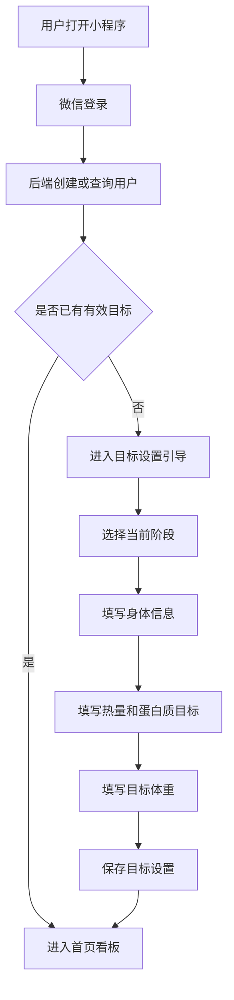
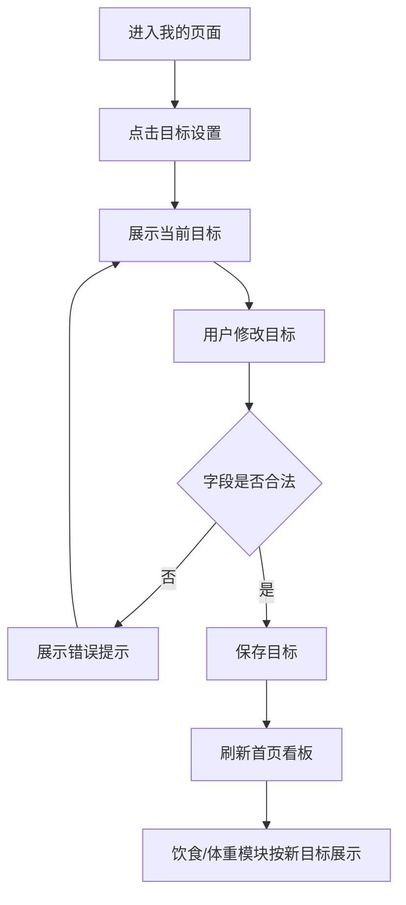

# 目标设置与用户基础信息模块 PRD

## 1. 模块定位

目标设置与用户基础信息模块用于记录用户身体基础信息、当前阶段目标和每日营养目标，是首页看板、饮食统计和体重目标展示的数据基础。

MVP 阶段核心定位：

> 让用户手动设置减脂 / 增肌阶段核心目标，并为首页、饮食、体重模块提供统一目标数据。

## 2. MVP 功能范围

第一版实现：

1. 微信授权登录；
2. 获取用户唯一标识；
3. 设置当前阶段：减脂 / 增肌；
4. 设置每日热量目标；
5. 设置每日蛋白质目标；
6. 设置当前体重；
7. 设置目标体重；
8. 设置基础身体信息；
9. 编辑目标设置；
10. 首页读取目标数据；
11. 饮食模块读取热量和蛋白质目标；
12. 体重模块读取目标体重；
13. 所有用户数据按 user_id 隔离。

## 3. 非本期范围

MVP 不实现：

- 自动计算 TDEE；
- 自动计算基础代谢；
- 自动推荐热量目标；
- 自动推荐碳水和脂肪目标；
- 饮水目标；
- 微量营养素目标；
- AI 饮食计划；
- AI 训练计划；
- 多目标周期管理；
- 私教查看用户目标。

## 4. 核心原则

### 4.1 第一版以手动设置为主

用户手动填写每日热量目标、蛋白质目标和目标体重。MVP 不依赖复杂算法推荐。

### 4.2 目标数据统一管理

首页、饮食、体重模块都从同一份目标配置中读取数据。

### 4.3 按 user_id 隔离数据

所有目标、资料、饮食、训练、体重记录都必须绑定 user_id。

### 4.4 允许修改目标

用户可以从减脂切换到增肌，也可以调整每日目标。修改目标后：

- 影响未来展示；
- 不修改历史饮食、训练、体重记录。

## 5. 用户使用场景

### 5.1 首次进入小程序

用户首次登录后完成基础目标设置：

- 当前阶段；
- 当前体重；
- 目标体重；
- 每日热量目标；
- 每日蛋白质目标。

完成后进入首页。

### 5.2 修改减脂目标

用户将每日热量目标从 1800 kcal 修改为 2000 kcal。首页和饮食页立即按新目标展示。

### 5.3 从减脂切换到增肌

用户达到目标体重后，将当前阶段切换为增肌，并重新设置目标体重和每日目标。

## 6. 页面入口

1. 首次登录目标设置引导页；
2. 首页目标卡片入口；
3. 我的页面中的目标设置；
4. 我的页面中的个人基础信息。

## 7. 首次目标设置页

建议分 3 步：

### 第一步：选择当前阶段

- 减脂；
- 增肌。

### 第二步：填写身体信息

- 当前体重；
- 目标体重；
- 身高；
- 性别；
- 出生年份。

### 第三步：填写每日目标

- 每日热量目标；
- 每日蛋白质目标。

MVP 建议热量目标和蛋白质目标必填，其他信息可选。

## 8. 目标设置编辑页

用户可以修改：

- 当前阶段；
- 当前体重；
- 目标体重；
- 每日热量目标；
- 每日蛋白质目标；
- 身高；
- 性别；
- 出生年份。

切换阶段时提示：

> 切换阶段后，首页和饮食目标将按新的目标展示，历史记录不会被修改。

## 9. 当前体重与体重记录关系

目标设置页中的当前体重用于基础资料。

首页最新体重优先从体重记录模块读取。如果没有体重记录，才使用 user_profile.current_weight_kg。

如果用户在目标设置页修改当前体重，建议提示：

> 是否将当前体重同步保存为一条体重记录？

MVP 可默认同步生成体重记录。

## 10. 数据字段

### 10.1 user_account

| 字段 | 说明 |
|---|---|
| id | 账户 ID |
| user_id | 系统用户 ID |
| openid | 微信 openid |
| unionid | 微信 unionid，后续扩展 |
| status | normal/disabled/deleted |
| last_login_at | 最近登录时间 |
| created_at | 创建时间 |
| updated_at | 更新时间 |

### 10.2 user_profile

| 字段 | 说明 |
|---|---|
| id | 用户资料 ID |
| user_id | 用户 ID |
| nickname | 昵称 |
| avatar_url | 头像 |
| gender | male/female/unknown |
| birth_year | 出生年份 |
| height_cm | 身高 |
| current_weight_kg | 当前体重 |
| created_at | 创建时间 |
| updated_at | 更新时间 |

### 10.3 user_goal

| 字段 | 说明 |
|---|---|
| id | 目标 ID |
| user_id | 用户 ID |
| goal_stage | fat_loss/muscle_gain |
| calorie_target | 每日热量目标 |
| protein_target | 每日蛋白质目标 |
| target_weight_kg | 目标体重 |
| goal_status | active/archived |
| created_at | 创建时间 |
| updated_at | 更新时间 |

## 11. 核心流程

### 11.1 首次登录与目标设置

### 11.2 修改目标设置

## 12. 字段校验

### 12.1 当前阶段

必须选择 fat_loss 或 muscle_gain。

### 12.2 每日热量目标

- 必填；
- 正整数；
- 建议范围：800–6000 kcal。

### 12.3 每日蛋白质目标

- 必填；
- 正整数；
- 建议范围：20–400 g。

### 12.4 当前体重和目标体重

- 选填但建议填写；
- 范围：20–300 kg；
- 最多 1 位小数。

### 12.5 身高

- 选填；
- 范围：100–250 cm。

### 12.6 出生年份

- 选填；
- 不允许大于当前年份。

## 13. 模块联动规则

### 13.1 首页

读取：

- 当前阶段；
- 每日热量目标；
- 每日蛋白质目标；
- 目标体重。

### 13.2 饮食模块

读取：

- 每日热量目标；
- 每日蛋白质目标。

用于计算：

- 热量完成率；
- 蛋白质完成率；
- 剩余热量；
- 蛋白质还差多少。

### 13.3 体重模块

读取：

- 当前阶段；
- 目标体重。

用于计算距离目标体重。

### 13.4 训练模块

MVP 阶段只读取当前阶段作为展示或模板筛选预留字段。

## 14. 目标修改影响范围

### 14.1 立即生效

目标修改后以下页面按新目标展示：

- 首页；
- 饮食详情；
- 体重详情；
- 我的目标设置页。

### 14.2 不影响历史数据

目标修改不修改：

- 已保存饮食记录；
- 已保存训练记录；
- 已保存体重记录。

MVP 不做目标历史快照。

## 15. 接口建议

| 接口 | 方法 | 说明 |
|---|---|---|
| `/api/auth/wechat-login` | POST | 微信登录 |
| `/api/user/profile` | GET | 查询基础信息 |
| `/api/user/profile` | PUT | 更新基础信息 |
| `/api/user/goal` | GET | 查询当前目标 |
| `/api/user/goal` | PUT | 创建或更新目标 |

## 16. 空状态

### 16.1 未完成目标设置

文案：

> 先设置你的每日目标，开始管理饮食和训练。

按钮：

- 去设置目标。

### 16.2 未设置目标体重

文案：

> 设置目标体重后，可以查看距离目标还差多少。

按钮：

- 设置目标体重。

### 16.3 未设置身体信息

文案：

> 补充身高、体重等信息后，后续可以获得更准确的目标建议。

## 17. 验收标准

1. 用户首次打开小程序可以完成微信登录。
2. 未设置目标用户进入目标设置引导。
3. 用户可以选择减脂或增肌。
4. 用户可以填写每日热量目标。
5. 用户可以填写每日蛋白质目标。
6. 用户可以填写目标体重。
7. 设置完成后进入首页。
8. 首页可以读取目标数据。
9. 用户可以修改目标。
10. 修改目标后首页立即刷新。
11. 修改目标不影响历史饮食、训练、体重记录。
12. 用户数据按 user_id 隔离。

## 18. 技术风险

### 18.1 目标修改导致历史统计口径变化

MVP 处理方式：

- 历史记录本身不变；
- 页面按当前目标展示；
- 后续再增加目标历史表。

### 18.2 当前体重数据来源冲突

处理方式：

- 首页最新体重优先读取 weight_record；
- user_profile.current_weight_kg 仅作为基础资料和初始值。
