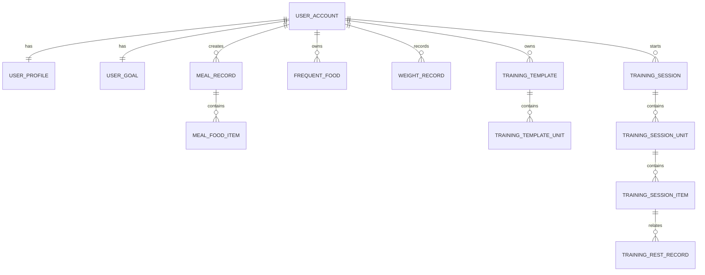

# 数据结构与后端接口总览 PRD

## 1. 模块定位

本模块统一描述健身与饮食记录微信小程序 MVP 阶段的核心数据结构、模块关系、接口边界和后端设计原则。

面向对象：

- 后端开发；
- 前端开发；
- 产品评审；
- 数据库设计；
- 接口联调；
- Codex 或其他代码生成工具。

## 2. 技术栈

- 前端：微信小程序；
- 后端：FastAPI；
- 数据库：MySQL；
- ORM：SQLAlchemy；
- 登录态：JWT；
- AI 食物识别：后端封装第三方服务，MVP 可 mock。

## 3. MVP 核心模块

1. 用户与登录模块；
2. 用户基础信息模块；
3. 目标设置模块；
4. 首页看板模块；
5. 饮食记录模块；
6. 常吃食物模块；
7. 体重记录模块；
8. 训练模板模块；
9. 训练执行模块；
10. 训练历史模块。

## 4. 数据设计原则

### 4.1 所有业务数据绑定 user_id

即使 MVP 只给个人使用，也必须按多人系统设计。

所有核心业务表必须包含：

- user_id；
- created_at；
- updated_at。

### 4.2 模板与历史分离

训练模板用于未来训练安排，训练记录保存真实训练结果。开始训练时从模板生成训练快照。

### 4.3 统计以服务端为准

首页看板、饮食汇总、体重趋势、训练状态等聚合数据由后端统一计算。

### 4.4 AI 识别结果不直接入库

饮食 AI 识别结果必须用户确认后才生成正式饮食记录。

### 4.5 删除优先软删除

建议软删除的数据：

- 饮食记录；
- 饮食明细；
- 常吃食物；
- 体重记录；
- 训练模板；
- 训练会话；
- 训练明细。

## 5. 核心实体关系



## 6. 数据表总览

### 6.1 user_account

用途：保存微信登录账户。

| 字段 | 说明 |
|---|---|
| id | 主键 |
| user_id | 系统用户 ID |
| openid | 微信小程序 openid |
| unionid | 微信 unionid |
| status | normal/disabled/deleted |
| last_login_at | 最近登录时间 |
| created_at | 创建时间 |
| updated_at | 更新时间 |

### 6.2 user_profile

用途：保存用户基础资料。

| 字段 | 说明 |
|---|---|
| id | 主键 |
| user_id | 用户 ID |
| nickname | 昵称 |
| avatar_url | 头像 |
| gender | male/female/unknown |
| birth_year | 出生年份 |
| height_cm | 身高 |
| current_weight_kg | 当前体重 |
| created_at | 创建时间 |
| updated_at | 更新时间 |

### 6.3 user_goal

用途：保存当前目标。

| 字段 | 说明 |
|---|---|
| id | 目标 ID |
| user_id | 用户 ID |
| goal_stage | fat_loss/muscle_gain |
| calorie_target | 每日热量目标 |
| protein_target | 每日蛋白质目标 |
| target_weight_kg | 目标体重 |
| goal_status | active/archived |
| created_at | 创建时间 |
| updated_at | 更新时间 |

### 6.4 meal_record

用途：保存一次饮食记录主信息。

| 字段 | 说明 |
|---|---|
| id | 饮食记录 ID |
| user_id | 用户 ID |
| record_date | 记录日期 |
| record_time | 具体时间 |
| meal_type | breakfast/lunch/dinner/snack |
| source_type | photo_ai/manual_search/frequent_food/custom |
| total_calorie | 本次总热量 |
| total_protein | 本次总蛋白质 |
| total_carb | 本次总碳水 |
| total_fat | 本次总脂肪 |
| status | draft/confirmed/revoked/deleted |
| is_saved_as_frequent | 是否保存为常吃 |
| created_at | 创建时间 |
| updated_at | 更新时间 |

### 6.5 meal_food_item

用途：保存饮食记录中的食物明细。

| 字段 | 说明 |
|---|---|
| id | 明细 ID |
| meal_record_id | 所属饮食记录 |
| user_id | 用户 ID |
| food_name | 食物名称 |
| food_category | 食物分类 |
| portion_desc | 份量描述 |
| weight_g | 克数 |
| calorie | 热量 |
| protein | 蛋白质 |
| carb | 碳水 |
| fat | 脂肪 |
| data_source | ai/standard_db/user_custom/frequent |
| is_user_modified | 是否用户修改 |
| is_deleted | 是否删除 |
| created_at | 创建时间 |
| updated_at | 更新时间 |

### 6.6 frequent_food

用途：保存用户个人常吃食物。

| 字段 | 说明 |
|---|---|
| id | 常吃食物 ID |
| user_id | 用户 ID |
| food_name | 食物名称 |
| default_portion_desc | 默认份量 |
| default_weight_g | 默认克数 |
| calorie | 默认热量 |
| protein | 默认蛋白质 |
| carb | 默认碳水 |
| fat | 默认脂肪 |
| source_type | ai_saved/custom/manual |
| use_count | 使用次数 |
| last_used_at | 最近使用时间 |
| status | active/deleted |
| created_at | 创建时间 |
| updated_at | 更新时间 |

### 6.7 food_database

用途：保存基础食物营养数据。

| 字段 | 说明 |
|---|---|
| id | 食物库 ID |
| food_name | 食物名称 |
| alias_names | 别名 |
| category | 分类 |
| calorie_per_100g | 每 100g 热量 |
| protein_per_100g | 每 100g 蛋白质 |
| carb_per_100g | 每 100g 碳水 |
| fat_per_100g | 每 100g 脂肪 |
| source | 数据来源 |
| status | active/disabled |
| created_at | 创建时间 |
| updated_at | 更新时间 |

### 6.8 weight_record

用途：保存体重历史。

| 字段 | 说明 |
|---|---|
| id | 体重记录 ID |
| user_id | 用户 ID |
| weight_kg | 体重 |
| record_time | 记录时间 |
| record_date | 记录日期 |
| note | 备注 |
| status | normal/deleted |
| created_at | 创建时间 |
| updated_at | 更新时间 |

### 6.9 training_template

用途：保存训练模板。

| 字段 | 说明 |
|---|---|
| id | 模板 ID |
| user_id | 用户 ID |
| template_name | 模板名称 |
| description | 描述 |
| goal_type | fat_loss/muscle_gain/strength/other |
| status | active/deleted |
| created_at | 创建时间 |
| updated_at | 更新时间 |

### 6.10 training_template_unit

用途：保存模板训练单元。

| 字段 | 说明 |
|---|---|
| id | 模板单元 ID |
| template_id | 模板 ID |
| user_id | 用户 ID |
| unit_type | normal/superset/dropset |
| unit_name | 单元名称 |
| sort_order | 排序 |
| config_json | 单元配置 |
| created_at | 创建时间 |
| updated_at | 更新时间 |

### 6.11 training_session

用途：保存一次训练会话。

| 字段 | 说明 |
|---|---|
| id | 训练会话 ID |
| user_id | 用户 ID |
| template_id | 来源模板 ID |
| template_name_snapshot | 模板名称快照 |
| session_status | draft/in_progress/resting/completed/interrupted_saved/abandoned |
| start_time | 开始时间 |
| end_time | 结束时间 |
| duration_seconds | 训练总时长 |
| current_unit_id | 当前训练单元 |
| current_item_id | 当前训练项 |
| is_snapshot | 是否快照 |
| created_at | 创建时间 |
| updated_at | 更新时间 |

### 6.12 training_session_unit

用途：保存本次训练快照中的训练单元。

| 字段 | 说明 |
|---|---|
| id | 会话单元 ID |
| session_id | 所属训练会话 |
| user_id | 用户 ID |
| unit_type | normal/superset/dropset |
| unit_name | 单元名称快照 |
| sort_order | 排序 |
| status | not_started/in_progress/completed/skipped/unfinished |
| created_at | 创建时间 |
| updated_at | 更新时间 |

### 6.13 training_session_item

用途：保存具体训练执行项。

| 字段 | 说明 |
|---|---|
| id | 明细 ID |
| session_id | 训练会话 ID |
| session_unit_id | 训练单元 ID |
| user_id | 用户 ID |
| exercise_name | 动作名称 |
| round_index | 超级组或递减组轮次 |
| set_index | 普通动作组序号 |
| segment_index | 递减组重量段序号 |
| target_weight | 目标重量 |
| target_reps | 目标次数 |
| actual_weight | 实际重量 |
| actual_reps | 实际次数 |
| target_rest_seconds | 目标休息秒数 |
| actual_rest_seconds | 实际休息秒数 |
| status | not_started/in_progress/completed/skipped/unfinished |
| is_temporary_added | 是否临时加组 |
| completed_at | 完成时间 |
| created_at | 创建时间 |
| updated_at | 更新时间 |

### 6.14 training_rest_record

用途：保存每一次休息记录。

| 字段 | 说明 |
|---|---|
| id | 休息记录 ID |
| session_id | 训练会话 ID |
| user_id | 用户 ID |
| related_item_id | 关联完成的训练项 |
| planned_rest_seconds | 计划休息秒数 |
| rest_start_time | 休息开始时间 |
| rest_target_end_time | 计划结束时间 |
| rest_actual_end_time | 实际结束时间 |
| actual_rest_seconds | 实际休息秒数 |
| end_type | natural_end/skipped/extended |
| created_at | 创建时间 |
| updated_at | 更新时间 |

## 7. 接口总览

### 7.1 认证与用户

| 接口 | 方法 | 说明 |
|---|---|---|
| `/api/auth/wechat-login` | POST | 微信登录 |
| `/api/user/profile` | GET | 查询用户资料 |
| `/api/user/profile` | PUT | 更新用户资料 |
| `/api/user/goal` | GET | 查询当前目标 |
| `/api/user/goal` | PUT | 创建或更新目标 |

### 7.2 首页

| 接口 | 方法 | 说明 |
|---|---|---|
| `/api/home/dashboard?date=YYYY-MM-DD` | GET | 查询首页聚合数据 |

### 7.3 饮食

| 接口 | 方法 | 说明 |
|---|---|---|
| `/api/diet/recognize` | POST | 图片识别 |
| `/api/diet/foods/search` | GET | 搜索食物 |
| `/api/diet/records/confirm` | POST | 确认饮食记录 |
| `/api/diet/records` | GET | 查询饮食记录 |
| `/api/diet/records/{record_id}` | PUT | 编辑饮食 |
| `/api/diet/records/{record_id}` | DELETE | 删除饮食 |
| `/api/diet/records/{record_id}/revoke` | POST | 撤销饮食 |
| `/api/diet/frequent-foods` | GET | 常吃食物列表 |
| `/api/diet/frequent-foods` | POST | 新增常吃食物 |
| `/api/diet/frequent-foods/{food_id}` | DELETE | 删除常吃食物 |

### 7.4 体重

| 接口 | 方法 | 说明 |
|---|---|---|
| `/api/weight/records` | POST | 新增体重 |
| `/api/weight/records` | GET | 查询体重列表 |
| `/api/weight/records/{record_id}` | PUT | 编辑体重 |
| `/api/weight/records/{record_id}` | DELETE | 删除体重 |
| `/api/weight/trend?range=7d` | GET | 7 天趋势 |
| `/api/weight/trend?range=30d` | GET | 30 天趋势 |

### 7.5 训练

| 接口 | 方法 | 说明 |
|---|---|---|
| `/api/training/templates` | POST | 创建模板 |
| `/api/training/templates` | GET | 模板列表 |
| `/api/training/templates/{template_id}` | GET | 模板详情 |
| `/api/training/templates/{template_id}` | PUT | 更新模板 |
| `/api/training/templates/{template_id}` | DELETE | 删除模板 |
| `/api/training/sessions/start` | POST | 开始训练 |
| `/api/training/sessions/unfinished` | GET | 未完成训练 |
| `/api/training/sessions/{session_id}` | GET | 训练会话详情 |
| `/api/training/sessions/{session_id}/items/{item_id}/complete` | POST | 完成当前项 |
| `/api/training/sessions/{session_id}/items/{item_id}/skip` | POST | 跳过当前项 |
| `/api/training/sessions/{session_id}/rest/{rest_id}/skip` | POST | 跳过休息 |
| `/api/training/sessions/{session_id}/rest/{rest_id}/extend` | POST | 延长休息 |
| `/api/training/sessions/{session_id}/items/add-temp-set` | POST | 临时加组 |
| `/api/training/sessions/{session_id}/finish` | POST | 结束训练 |
| `/api/training/sessions/history` | GET | 训练历史 |
| `/api/training/sessions/{session_id}/history-detail` | GET | 历史详情 |

## 8. 首页聚合规则

### 8.1 饮食统计

统计：

- 当前用户；
- 指定日期；
- meal_record.status = confirmed。

不统计：

- draft；
- revoked；
- deleted。

### 8.2 训练状态

优先级：

1. 存在 in_progress 或 resting：进行中；
2. 当天存在 completed：已完成；
3. 当天存在 interrupted_saved：中断保存；
4. 否则：未开始。

本周训练次数统计 completed 和 interrupted_saved，不统计 abandoned。

### 8.3 体重展示

优先级：

1. 当天最新 normal 体重记录；
2. 最近一次历史体重；
3. user_profile.current_weight_kg；
4. 空状态。

## 9. 权限与安全

1. 除登录接口外，所有接口必须校验 token。
2. 后端通过 token 解析 user_id，不信任前端传入 user_id。
3. 用户不能访问其他用户数据。
4. 通过 record_id 查询时必须校验数据归属。
5. 日志中不应完整打印 token、openid、身体数据、饮食明细、体重历史。

## 10. 错误码建议

| 错误码 | 说明 |
|---:|---|
| 0 | 成功 |
| 40001 | 登录已失效 |
| 40002 | 无权限访问 |
| 40003 | 参数错误 |
| 40004 | 数据不存在 |
| 40005 | 数据状态不允许操作 |
| 41001 | 饮食识别失败 |
| 41002 | 食物库无匹配结果 |
| 42001 | 存在未完成训练 |
| 42002 | 训练会话不存在 |
| 42003 | 当前训练项状态异常 |
| 43001 | 体重数值不合法 |
| 44001 | 目标设置不完整 |
| 50000 | 系统异常 |

## 11. 统一响应格式

成功：

```json
{
  "code": 0,
  "message": "success",
  "data": {}
}
```

失败：

```json
{
  "code": 40003,
  "message": "参数错误",
  "data": {
    "field": "calorie_target",
    "reason": "每日热量目标必须大于 0"
  }
}
```

分页：

```json
{
  "code": 0,
  "message": "success",
  "data": {
    "list": [],
    "page": 1,
    "page_size": 20,
    "total": 100,
    "has_more": true
  }
}
```

## 12. 后端分层建议

```text
controller 层：处理请求和响应
service 层：处理业务逻辑
repository / dao 层：处理数据库访问
adapter 层：封装第三方 AI 食物识别服务
common 层：鉴权、错误码、工具函数
```

建议服务：

- AuthService；
- UserService；
- HomeDashboardService；
- DietService；
- DietStatsService；
- FoodRecognitionAdapter；
- WeightService；
- TrainingTemplateService；
- TrainingSessionService。

## 13. MVP 验收标准

1. 所有业务表均包含 user_id。
2. 用户数据可以按 user_id 隔离。
3. 首页数据通过统一聚合接口返回。
4. 饮食记录支持一条主记录多条明细。
5. AI 识别结果确认后才入库。
6. 体重记录支持同一天多条。
7. 训练模板和训练记录分离。
8. 开始训练时生成训练快照。
9. 历史训练不受模板修改影响。
10. 未登录不能访问业务接口。
11. 用户不能访问其他用户数据。
12. 新增、编辑、删除数据后首页统计一致。
